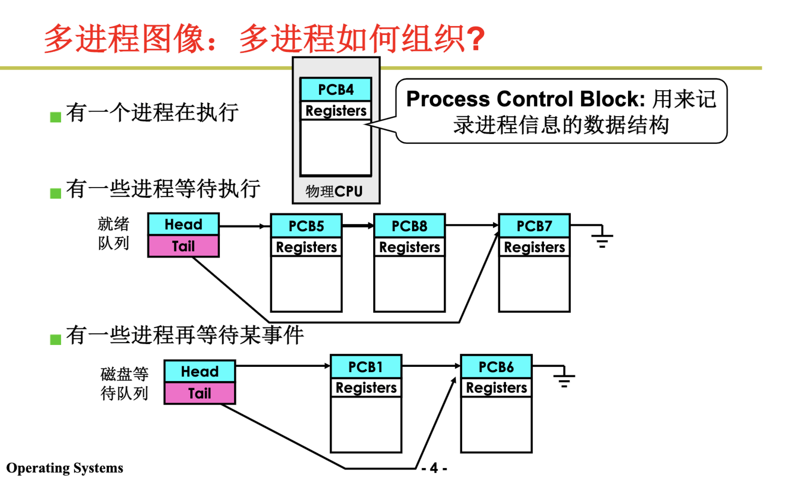
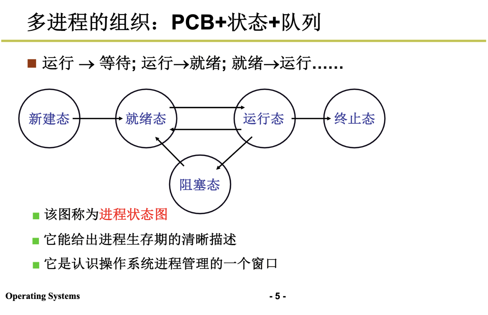
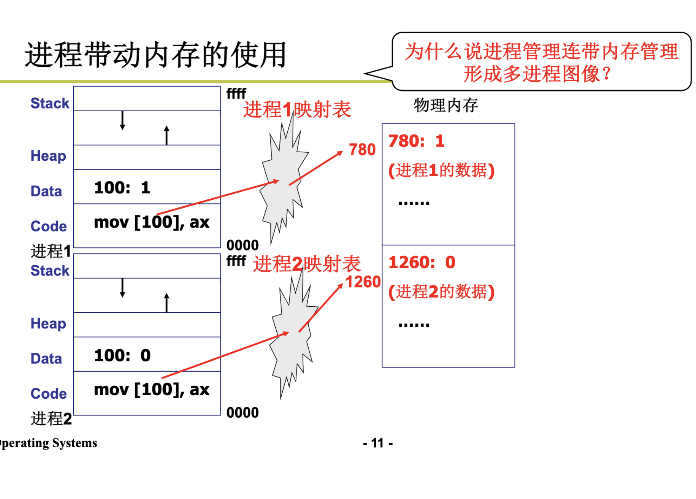

## 进程

## 如何组织

根据pcb,状态，形成不同的队列放在不同的位置





## 如何交替

队列操作 + 调度 + 切换

```
启动磁盘读写；
pCur.state = 'W';  # 设置成阻塞态
将pCur放到DiskWaitQueue;
schedule();  # 切换 ***

schedule() {
    pNew = getNext(ReadyQueue);  # getNext是调度 -- 从queue里找一个合适的任务
    # 把当前的状态环境保存，把下一个执行现场恢复
    switch_to(pCur, pNew);  # pCur, pNew都是pcb
}

switch_to(pCur, pNew) {
    # 把cpu当前信息保存在结构体里
    pCur.ax = CPU.ax;
    pCur.bx = CPU.BX;
    ...
    pCur.cs = CPU.cs;
    pCur.retpc = CPU.pc;

    # 现场恢复
    # 把cpu当前信息保存在结构体里
    CPU.ax = pNew.ax;
    CPU.BX = pNew.bx;
    ...
    CPU.cs = pNew.cs;
    CPU.retpc = pNew.pc;
}

```

## 多进程如何影响

```
# prcess 1 :
mov ax, 101100b
mov [100], ax

# process 2 
100 :00101

# 因为dpl=3, cpl=3, 内存地址相互访问没问题
# 解决办法 ：限制对地址100的读写
# 多进程的地址空间分离 ： 内存管理的内容 (通过映射表)
```



## 多进程如何合作

生产者消费者

```
# problem
# producer 
register = counter;
resister = register + 1;
counter = register;

# consumer 
register = counter;
register = register - 1;
counter = register;

# negative case: 
# initital counter = 5;
P.register = counter; # 5
P.register = P.register + 1; # 6
## swtich to C
C.register = counter; # 5
C.register = C.register -1; # 4
## swtich to P 
counter = P.register; # 6
counter = C.register; # 4 

# The result shoud be 5 but we get 4
# 上锁
```