## 线程

## 用户级线程

如何引出线程 -- 线程和进程区别

只用切换指令，而不切换资源(内存--映射表等)，减少了切换的代价

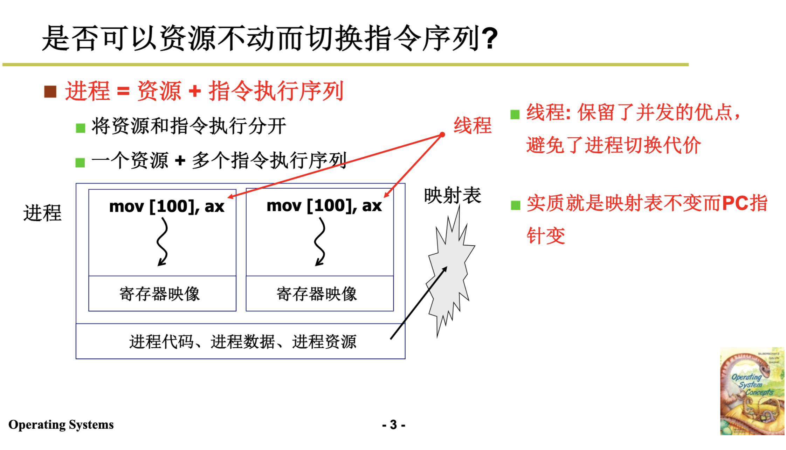

## create and yield

用户级线程不会进入内核态，所以切换要调用函数yield(核心)

能切换就需要知道 切换时需要什么样

create 就是要制造出第一次切换时应该的样子


## 为什么共享一个栈会出问题

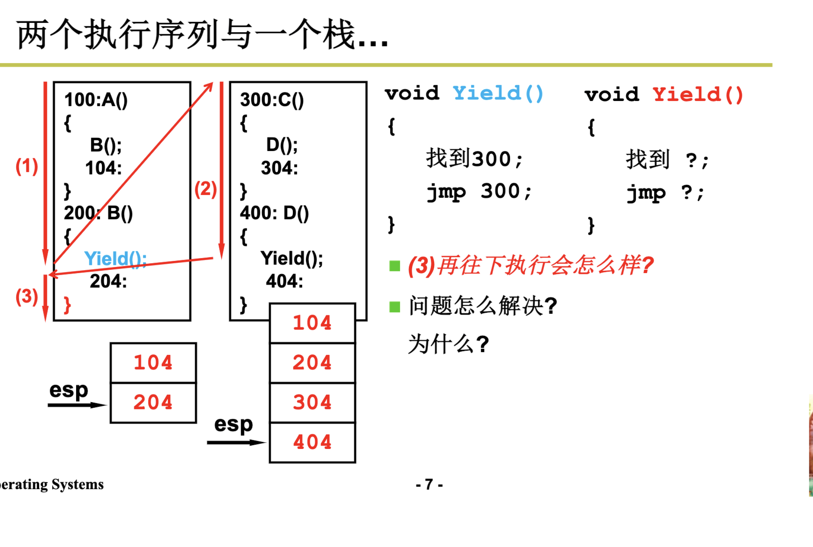

当你执行到右边那个yield的时候，然后回到204，然后执行完执行汇编指令ret,弹栈，但是弹的是404

我们yiled跨现场导致ret也跨，搞的栈混乱，所以我们要分开两个栈管各自

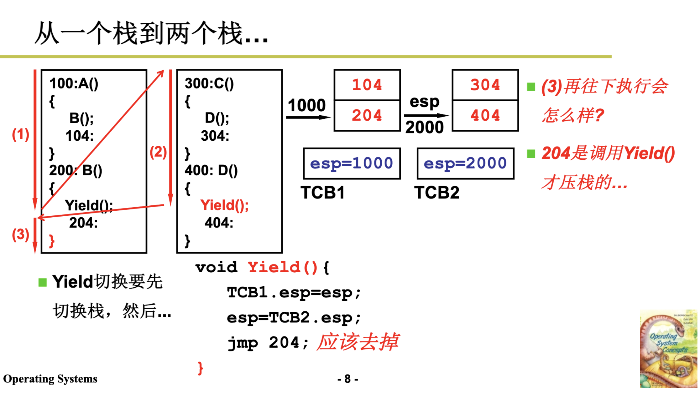

所以我们这从400的yield执行后，切换回第一个线程，我们首先要把栈切回去

所以刚才那种情况弹栈的时候，栈已经切过来了，弹出的就是204

TCP这个数据结构存储信息

这里有个问题，你jmp 204执行后，然后执行完弹栈又是执行204，所以这里去掉jmp，yiled已经把栈切换了，然后弹栈自动就到204了，然后正确执行

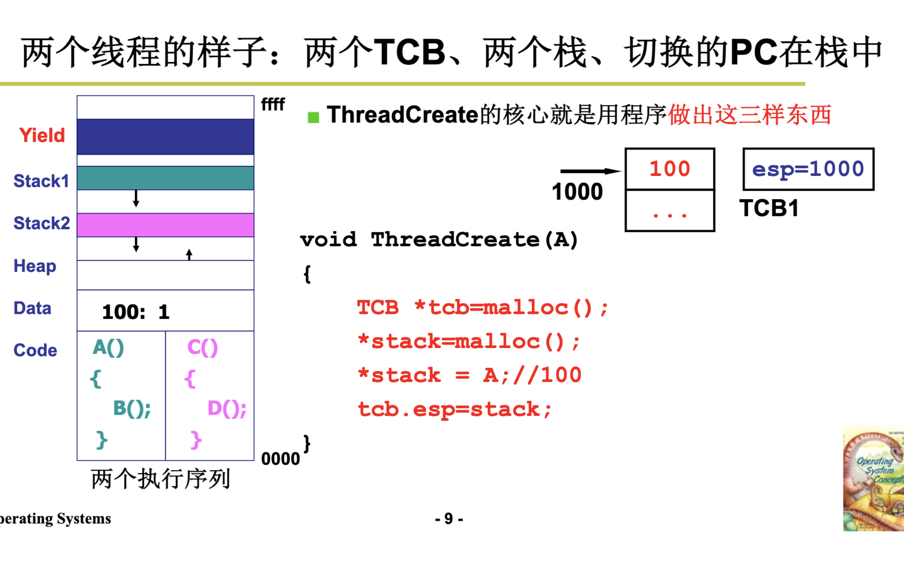

用户级线程就是靠yield在用户态切来切去

缺点: 当切到别的进程，就不work了

内核级线程并发会更好一些

为什么没用户态进程(因为进程需要切换资源)

## 内核级线程

为什么多核需要线程才能起并发作业

首先看多核与多处理器的区别

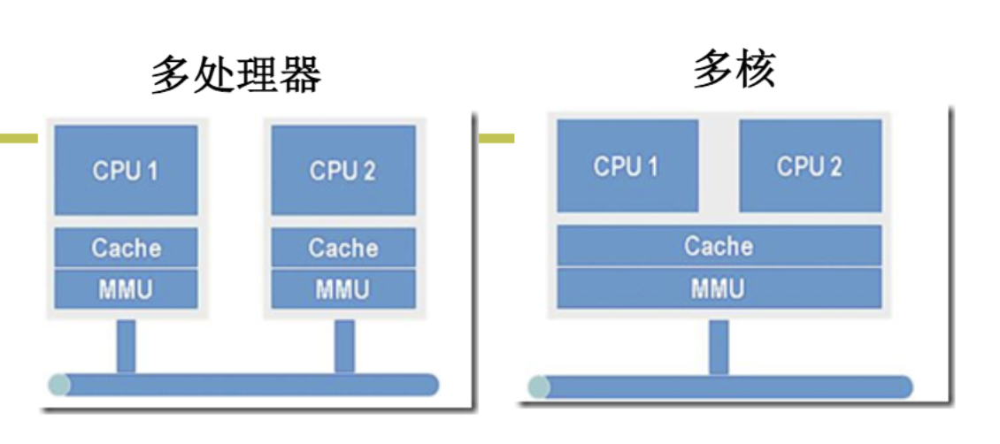

MMU你就是内存映射表，多核是共用一套MMU，线程正好就是共享一套，每一个核分配一个线程

用户级线程是在用户态切来切去，无法利用多核

## 内核级线程 vs 用户级线程

核心 : 一个栈 -> 一套栈(用户栈/内核栈)

用户级线程是:通过tcb切换去切换用户栈

核心级线程是:通过tcp切换，去切换一套栈(用户栈/内核栈都要切)

进入内核的唯一方法是中断

## 如何关联用户栈和内核栈?

hint: 

SS : 存放栈的段地址

SP : stack pointer : 存放栈的偏移地址

通过SS:SP我们可以找到栈顶元素

通过弹栈可以回到用户态位置CS:IP和用户栈SS:SP

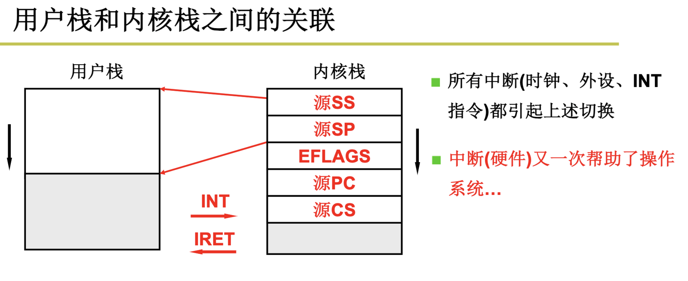

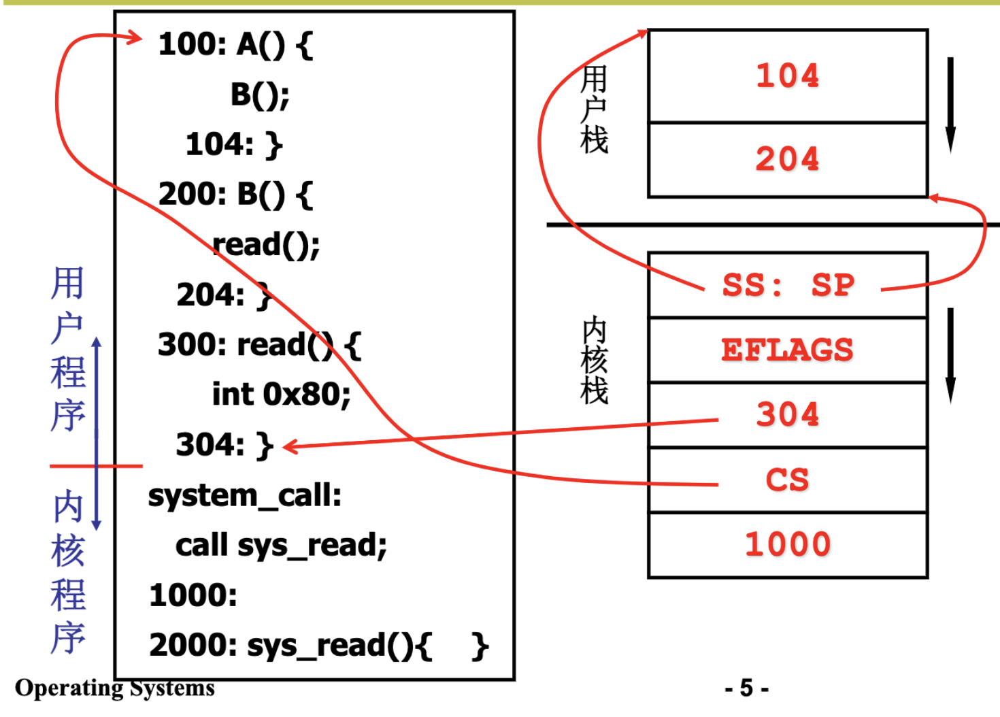

## 开始内核中的切换

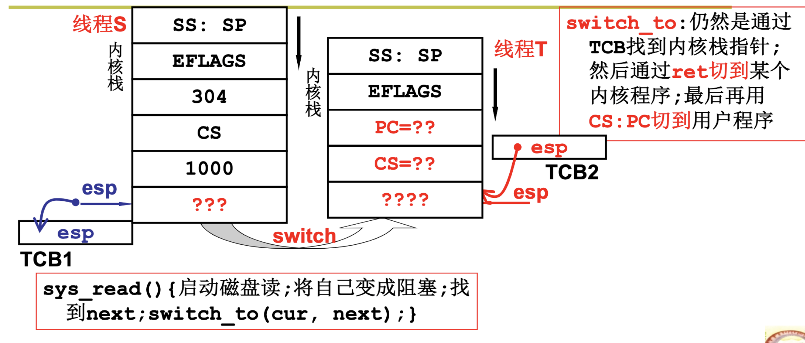

???? ： iret代码

过程 ：线程T和线程S

线程T在用户态执行，遇到了个系统调用，比如read，然后中断进入内核

然后开始内核中的切换


```
sys_read() {
    启动磁盘，将自己变成阻塞；
    找到next;
    switch_to(cur, next); # cur, next 是tcb
}
```
通过next 的tcb找到内核栈指针，切到某个线程S的内核程序，然后iret通过CS:PS切到用户程序，然后通过SS:SP切到S的用户栈

总结 ： 先中断进入内核，在需要切换(阻塞。。)时，找next tcb，在iret切换到用户

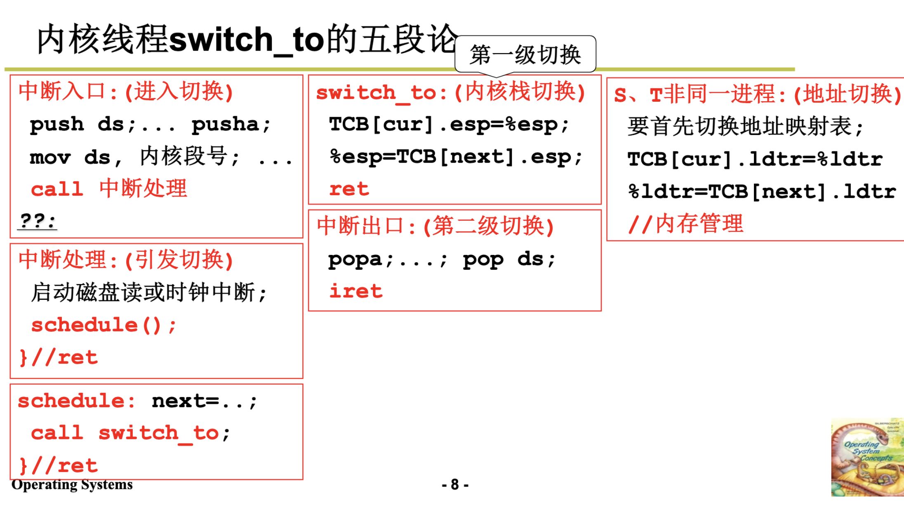

## ThreadCreate

```
void ThreadCreate(...) {
    # 首先申请一片内存作为tcb
    TCB tcb = get_free_page();
    # 填写两个stack
    *krlstack = ...;
    *userstack传入；

    tcb.esp = krlstack;  
    tcb.状态 = 就绪;
    tcb入队;
}
```

## 内核级线程代码实现

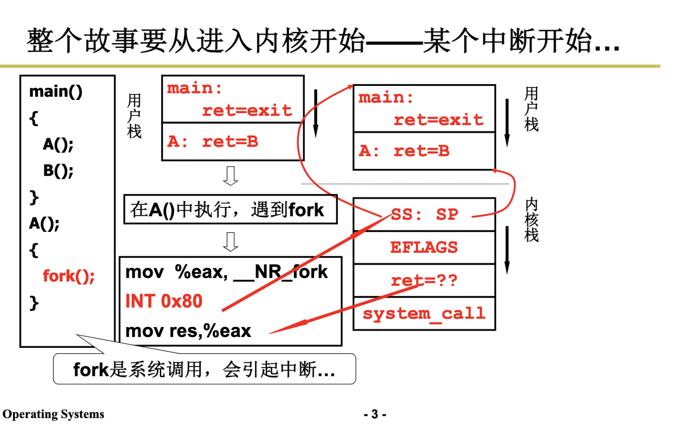

先压用户栈，然后是下一个要执行的地址，然后压入system_call

## 切换五段论中的中断入口和中断出口

int 0x80所对应的函数是system_call

```
void sched_init(void)
{set_system_gate(0x80,&system_call);}
```

初始化时将各种中断处理设置好，继续压栈

```
_system_call:
push %ds..%fs
pushl %edx...
call sys_fork
pushl %eax
# 将用户态压栈保存好
```

中断一堆push + 人工push

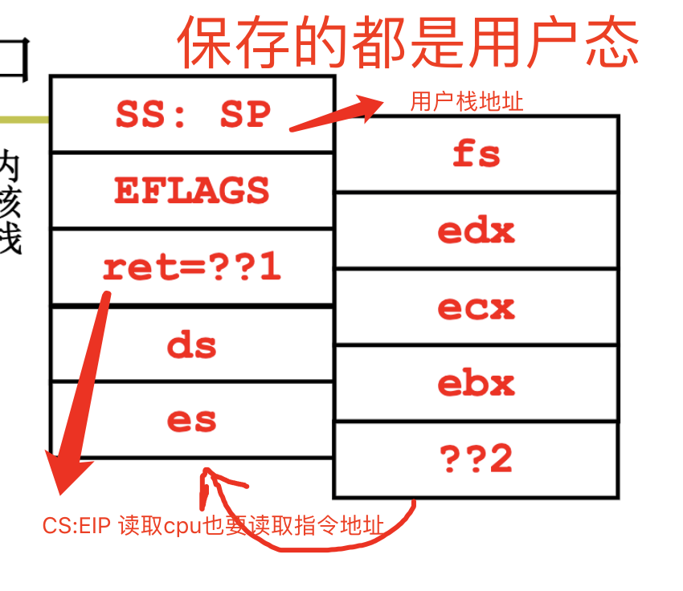

```
# 执行完后需要判断
# cur是PCB
movl _current,%eax
# = state + cur , 现在的状态是否为0(0为运行or就绪)
cmpl $0,state(%eax) 
jne reschedule  # 如果不是(阻塞)则需要调度,如果是read/write阻塞等待其他资源，直接把状态调为非0即可
# 这里看时间片是否用光需要调度
cmpl $0,counter(%eax)  
je reschedule
# 跳出去再调回来执行中断返回函数
ret_from_sys_call:
 
reschedule:
pushl $ret_from_sys_call
jmp _schedule  # 这是个c函数，遇到}弹回
```

```
# 详见调度算法，调一个next就完事
void schedule(void) {
    next = i;
    switch_to(next); # next 下一个线程的tcb
}
```

```
# 最后一段中断返回
ret_from_sys_call：
    # 对应之前的push
    popl %eax 
    popl %ebx 
    ...
    pop %fs 

    # 弹出刚才自动push的栈，到SS:SP就到了用户栈
    iret 
```

## switch_to 

TSS : task State  segment 

Linux 0.11 用tss切换(虽然只需要一条长跳转指令就可完成但效率比较慢)，现在都用栈切换(可以使用指令流水的并行优化技术，同时又使得 CPU 的设计变得简单)

tss通过选择符TR找到TSS描述符，再找到tss段

所谓的 TSS 切换就将 CPU 中几乎所有的寄存器都复制到 TR 指向的那个 TSS 结构体中保存起来，同时找到一个目标 TSS，即要切换到的下一个进程对应的 TSS，将其中存放的寄存器映像“扣在” CPU 上，就完成了执行现场的切换


具体流程：

1. 首先用 TR 中存取的段选择符在 GDT 表中找到当前 TSS 的内存位置, TR 和 CS、DS 等寄存器的功能是完全类似的。

2. 找到了当前的 TSS 段（就是一段内存区域）以后，将 CPU 中的寄存器映像存放到这段内存区域中，即拍了一个快照。

3. 存放了当前进程的执行现场以后，接下来要找到目标进程的现场，并将其扣在 CPU 上(就相当于切换到了目标进程的执行现场, 因为那里有目标进程停下时的 CS:EIP，所以此时就开始从目标进程停下时的那个 CS:EIP 处开始执行，现在目标进程就变成了当前进程)

4. TR 需要修改为目标 TSS 段在 GDT 表中的段描述符所在的位置，因为 TR 总是指向当前 TSS 段的段描述符所在的位置。


```
## 具体分析略
#define switch_to(n) {
    struct{long a,b;} tmp;
    __asm__(
        "movw %%dx,%1"
        "ljmp %0" ::"m"(*&tmp.a), "m"(*&tmp.b), "d"(TSS(n)
    )
 }

#define FIRST_TSS_ENTRY 4

#define TSS(n) (((unsigned long) n) << 4) + (FIRST_TSS_ENTRY << 3))
```


这里改成栈的做法

[线程实验](./04_thread_exp.md)

## ThreadCreate

这里就是把tss做好

```
sys_fork:
	push %gs
    ...
	pushl %eax
    # 核心在拷贝
	call copy_process
	addl $20,%esp
    ret
```

```
//  创建栈
// 总结就是
// 1. 申请内存空间
// 2. 创建TCB
// 3. 创建内核栈和用户栈
// 4. 无 - 填写两个stack 
// 5. 关联栈和TCB
int copy_process(int nr,long ebp,long edi,long esi,long gs,long none,
		long ebx,long ecx,long edx,
		long fs,long es,long ds,
		long eip,long cs,long eflags,long esp,long ss)
{
    // 申请内存空间，malloc是用户态不能用
	p = (struct task_struct *) get_free_page();
    
    // 扣cpu，一大堆tss赋值
    // esp0是内核栈
	p->tss.esp0 = PAGE_SIZE + (long) p;
	p->tss.ss0 = 0x10;  // 0x10 内核数据段
	
    // esp 用户栈(父进程传下来的参数，和父进程共用用户栈)
	p->tss.esp = esp;
	p->tss.ss = ss & 0xffff;

    // ... 内存部分
}

```