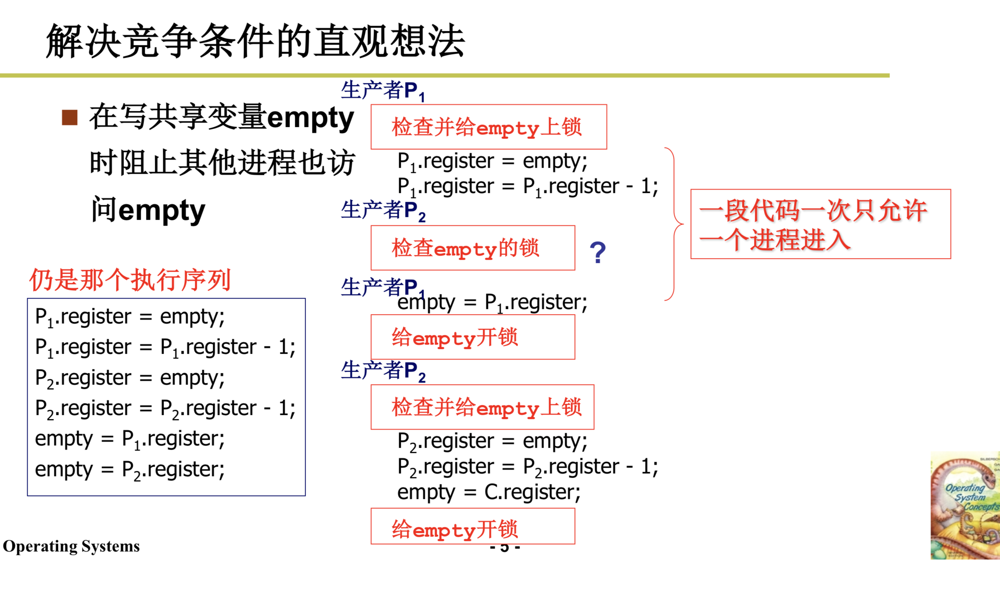

## 进程同步和信号量

### 为什么我们需要信号量


无足够信息来表达来了几个producer


sem = -1 表示缺一个，一个进程在等待

sem = 1 ,如果再来一个producer，不sleep(还有一个空闲缓冲区)


```c
V(semaphore s) {
    s.value++;
    if(s.value <= 0) {
        wakeup(s.queue);
    }
}
```


full 表示 已经产生的

empty 表示 空闲缓冲区个数

mutex: 互斥信号量

仅允许一个去写文件

一旦一个进去了 P(mutex) -> mutex = 0, 另一个P(mutex),就sleep，阻塞在那

## 信号量临界区保护




要全做完，要么不做，不能做到一半切出去

## 临界区

读写信号量的代码一定是临界区

```
进入区
临界区
退出区
```

进入区和退出区代码如何实现

## 临界区代码的保护原则


## 方法1 : 轮换法

满足互斥进入

不满足有空让进

## 方法2 : 标记法


当执行1，切出去到2，这几个时候flag[0],flag[1]都为1

不管切回3还是继续执行4，那么都在这空转

## 非对称标记

## 两个进程 : Peterson算法


## 多个进程 : 面包店算法


```c
// 每次去取号，取当前号数中最大的
num[i] = max(num[0], ... , num[n-1]) + 1;

// 如果不是最小的就空转，--> 最小的进入执行
while((num[j] != 0) && (num[j]) < num[i]));

```

## 更简单的方法

1. 软件方法 -- 面包点算法 太复杂

2. 硬件办法 -- 阻止调度的中断

关中断cli(),开中断sti()


多cpu(多核)不好使 : 

将其中一个CPU对应的INTR(reg)置1去关中断，对多个CPU无效。

3. 硬件原子指令

不能被打断  --> 修改原子变量mutex，一次执行完毕不切出去

对临界区进行上锁，即使用一个变量，但如果使用变量的话，修改这个变量同时需要保护。

所以要使用硬件原子指令，这样就不会被打断。通过硬件原子指令来修改这个整型变量，来进行上锁。修改变量的过程是硬件的，不会被打断。

多CPU同样适用

## 总结

用临界区保护信号量，用信号量完成同步

## 信号量实现

```c
// 内核中有一堆信号量，此处有个信号量数组
// 相同名字打开同一个信号量
// 对应了相应的值，还有个task 队列
typedef struct semaphore{
    char name[SEM_NAME_LEN];
    int value;
    struct task_struct *queue;
} sem_t;
extern sem_t semtable[SEMTABLE_LEN];

// 设置系统调用函数
sem_t *sys_sem_open(const char *name) { 
    ...
}
```
```c
// 用户态
sd = sem_open("empty");
// 在semtable中寻找name对上的，没找到则创建，返回对应下标
// 根据这个信号量的值去决定是否走，是否阻塞

for(i = 1 to 5) {
    sem_wait(sd);  // 要去看value是否能够继续运行下一步
    write(fd, &i, 4);
}

sys_sem_wait(int sd) {
    cli();  // 单核利用简单的开关中断保护临界区
    if(semtable[sd].value -- < 0) {
        设置自己为阻塞;
        将自 己加入semtable[sd].queue 中;
        schedule();  // 睡眠，去切换调取其他任务
    }
    sti(); }
```

## linux 0.11 中的信号量实现和应用 读磁盘块

```c
// sys_read最终落实到bread上
bread(int dev,int block) {
    struct buffer_head * bh;
    ll_rw_block(READ,bh);
    wait_on_buffer(bh);
    ...
}
// 此处是在内存中申请一片缓冲区去读磁盘块中的内容
// 然后去读磁盘，然后阻塞停住，等待磁盘读完由磁盘中断将其唤醒，也是一种同步
// 这个bh带有一个信号量b_lock

lock_buffer(buffer_head*bh) {
    cli();
    while(bh->b_lock)   // 如果b_lock为1，上锁，sleep，注意这里是while
        sleep_on(&bh->b_wait);
    bh->b_lock = 1;   // 这里表示上锁，未读完，通过中断来解锁
    sti(); 
}

// 探究这里为什么要用while，先看sleep_on实现
void sleep_on(struct task_struct **p){
    struct task_struct *tmp;
    tmp = *p;      // 1
    *p = current;   // 2
    // 把自己塞进队列然后设置成阻塞态然后切出去，等待磁盘中断来唤醒
    current->state = TASK_UNINTERRUPTIBLE;
    schedule();
    if (tmp)
        tmp->state=0;
}
// 1, 2是世界上最隐蔽的队列，这两句话的意思是把自己放在队列中

```

## sleep_on形成的队列

```c
sleep_on(struct task_struct **p)
p是一个指向task_struct结构体的指针的指针(是指向队首的指针)

首先申请一个局部变量 
struct task_struct *tmp;

```


## 如何唤醒

```c
// 磁盘中断
static void read_intr(void) {
    ...
    end_request(1);
}

end_request(int uptodate) {
    ...
    unlock_buffer(CURRENT->bh);
} 

unlock_buffer(struct buffer_head* bh) {
    bh->b_lock = 0;   // 解锁
    wake_up(&bh->b_wait);  // 唤醒
}

// 传入的还是那个队首
wake_up(struct task_struct **p) {
    if(p && *p) {
        (**p).state = 0;  // 设置为就绪
        *p = NULL;
    }
}

```

```c
// 再回到sleep_on
schedule()   // 之前切换出去，然后切换回来从这开始
if(tmp) {
    tmp->state = 0;
}
// 这里的作用，下面红色的task_staruct 是被唤醒的对手进程
// 我被唤醒了，然后他的tmp指向的是阻塞队列的下一个进程
// 设置为0，就是去唤醒了下一个进程
// 下一个进程有如此，在唤醒下一个
```


总结下这里，中断把对手进程唤醒，然后把前一个task唤醒，然后唤醒再前一个

这里是将阻塞队列全部唤醒的机制

如果两个进程同时阻塞于此等待，a - b,a在前，但是可能b的优先级更高

我们应该都去唤醒，至于谁最是下一个执行，由schedule决定

```c
// 所以这里用while就是一次性全唤醒，但只有一个task是能够执行，出去得到锁，其他都要再次判断，继续等待
// 如果是if，这里全部唤醒了就进行下一步，肯定不对，需要while再次判断是否该轮到我
lock_buffer(buffer_head*bh) {
    cli();
    while(bh->b_lock)   
        sleep_on(&bh->b_wait);
    bh->b_lock = 1;   
    sti(); 
}
```

这里不需要负值，全部唤醒，用while

## 实验5要求用有负数的那种情况