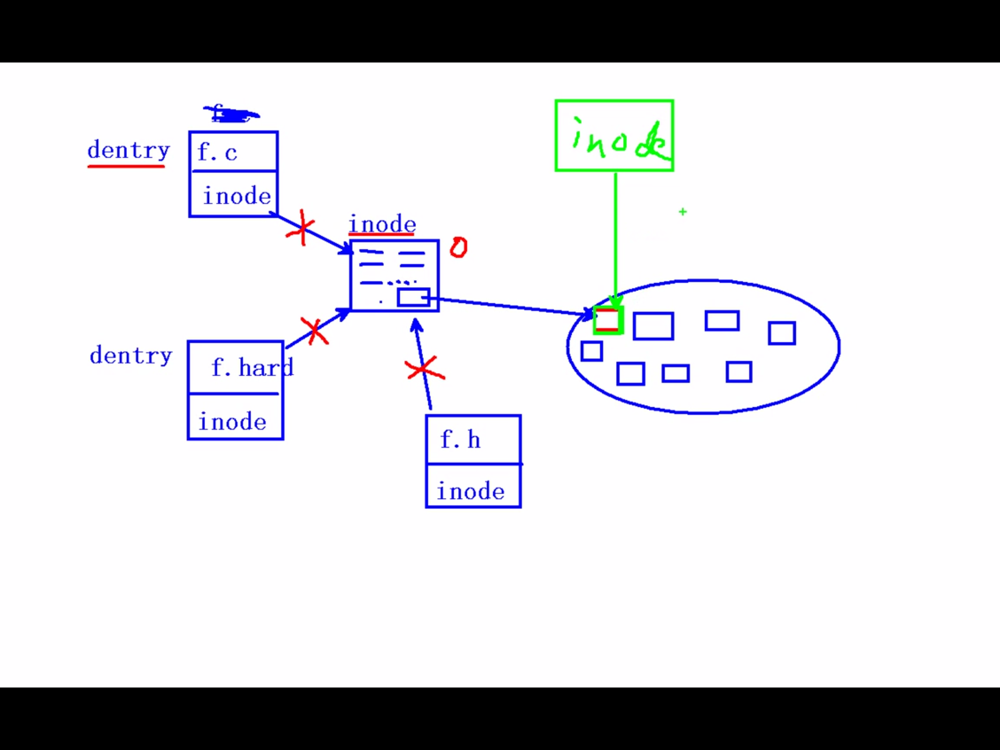
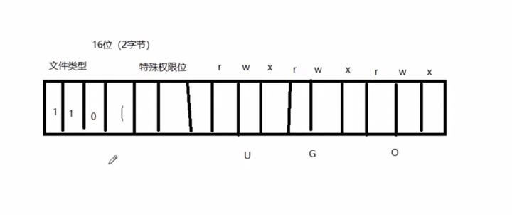

## I/O缓冲区

每一个FILE文件流都有一个缓冲区buffer，默认大小8192Byte。

write也不一定是直接写到文件的，也可能写到内核I/O缓冲区中，至于究竟写到了文件中还是内核缓冲区中对于进程来说是没有差别的.

如果进程A和进程B打开同一文件，进程A写到内核I/O缓冲区中的数据从进程B也能读到，而C标准库的I/O缓冲区则不具有这一特性 (todo why ???)


## open/close

int open(const char *pathname, int flags);

int open(const char *pathname, int flags, mode_t mode);

int close(int fd);

## 文件描述符

一个进程默认打开3个文件描述符

- STDIN_FILENO 0
- STDOUT_FILENO 1
- STDERR_FILENO 2

上限1203 -- 共1024个

新打开的文件描述符是可用的最小的那个

[open demo](../src/file/01_open.c)

## PCB

pcb task_struct结构体  

其中一个成员指针指向文件描述符表

文件描述符对应指向文件结构体的指针(成功打开的文件)，操作系统隐藏了指针的细节，只暴露了下标 -- files_struct结构体

里面成员是一系列文件信息


32位linux 

创建一个进程时，操作系统会为该进程分配一个 4GB 大小的虚拟进程地址空间。 之所以是 4GB ，是因为在 32 位的操作系统中，一个指针长度是 4 字节  （32位）， 2的32次 方个地址寻址能力是从 0x00000000~0xFFFFFFFF 即为 4GB 大小的容量。

4G 指的是最大的寻址空间为4G

一个进程用到的虚拟地址是由内存区域表来管理的，实际用不了4G。而用到的内存区域，会通过页表映射到物理内存。所以每个进程都可以使用同样的虚拟内存地址而不冲突，因为它们的物理地址实际上是不同的。

## **所有的系统函数都应该检查返回值**

perror

## read / write

ssize_t read(int fd, void *buf, size_t count);

[read/write实现cp](../src/file/02_mycp.c)


## 输入和输出

printf() and scanf()

getchar() & putchar() 

gets() & puts()

## 文件读写

fopen() and fclose()

fputc() and fputs()

fprintf() and fscanf

二进制 I/O 函数 fread() and fwrite()

strace(mac下为dtruss) ，跟踪程序

了解为什么fread/fwrite为什么要比系统调用read和write快(buf同设为1)

[对比实验getc](../src/file/03_getc_cmp_read.c)

[对比实验read](../src/file/03_read_cmp_getc.c)


从用户空间到内核很耗时

fputc函数有一个缓冲区(预读入缓输出)，凑够了4096再一起拷贝进内核缓冲区，而不是1个1个的进

read由于我们是把BUFSIZE设置成了1，所以每次1个就进内核空间

写入内核缓冲区则结束，什么时候刷入磁盘是os控制，在cpu空闲时刷入

标准IO函数自带用户缓冲区，系统调用无用户级缓冲。系统缓冲区是都有的。

优先使用库函数

## 阻塞/非阻塞

阻塞不是read / write的属性，而是设备、网络文件的属性

产生阻塞场景 : 读设备文件 / 网络文件 (读常规文件无阻塞概念)

[阻塞实验](../src/file/05_block_readtty.c)

[非阻塞实验](../src/file/06_nonblock_readtty.c)

## fcntl

在调用open时指定O_NONBLOCK标志。这里介绍另外一种办法，可以用
fcntl函数改变一个已打开的文件的属性，可以重新设置读、写、追加、非阻塞等标志（这
些标志称为File Status Flag），而不必重新open文件。

[fcntl](../src/file/08_fcntl.c)

## lseek

off_t lseek(int fd, off_t offset, int whence);

offset : 偏移量

whence : 起始偏移位置 SEEK_SET/SEEK_CUR/SEEK_END

[lseek demo1](../src/file/09_lseek.c)

[lseek demo2](../src/file/10_lseek_add.c)

[lseek 获取文件大小](../src/file/11_lseek_FileSz.c)

[利用trancate真实拓展文件大小](../src/file/12_trunc.c)


## 参数

传入参数：

1. 指针作为函数参数

2. 通常有const 关键字修饰

3. 指针指向有效区域，在函数内部做读操作

传出参数

1. 指针作为函数参数

2. 在函数调用之前，指针指向的空间可以无意义，但必须有效。

3. 在函数内部，做写操作，

4. 函数调用结束后，充当函数返回值

传入传出参数

1. 指针作为函数参数

2. 在函数调用之前，指针指向的空间要有实际意义

3. 在函数内部，先做读操作，后做写操作

4. 函数调用结束后，充当函数返回值

## 文件系统

inode / dentry

stat xx 
```bash
stat 11_lseek_FileSz.c 
  File: 11_lseek_FileSz.c
  Size: 831             Blocks: 8          IO Block: 4096   regular file
Device: 4ah/74d Inode: 56771501    Links: 1
Access: (0644/-rw-r--r--)  Uid: (    0/    root)   Gid: (    0/    root)
Access: 2021-03-22 10:39:09.702487662 +0800
Modify: 2021-03-22 10:39:09.531477716 +0800
Change: 2021-03-22 10:39:09.531477716 +0800
```

inode本质是个结构体，存储文件的属性信息，如权限，类型，大小，时间，用户，盘块位置。。。(就是ls -l查看的东西)也叫做文件的属性管理结构，大多数是的inode都存储在磁盘上，少量常用，近期使用的inode会被缓存到内存中

一个dentry包含一个文件名和inode号，通过inode号找到inode结构体，然后通过inode结构体中的盘块位置去磁盘找到文件

硬链接原理，inode一样，但是不同dentry



## 硬链接和软链接

Linux链接分两种，一种被称为硬链接（Hard Link），另一种被称为符号链接（Symbolic Link）。默认情况下，ln命令产生硬链接。

- 硬链接

在Linux的文件系统中，保存在磁盘分区中的文件不管是什么类型都给它分配一个编号，称为索引节点号(Inode Index)。在Linux中，多个文件名指向同一索引节点是存在的。一般这种连接就是硬连接。硬连接的作用是允许一个文件拥有多个有效路径名，这样用户就可以建立硬连接到重要文件，以防止“误删”的功能

只删除一个连接并不影响索引节点本身和其它的连接，只有当最后一个连接被删除后，文件的数据块及目录的连接才会被释放。也就是说，文件真正删除的条件是与之相关的所有硬连接文件均被删除。

- 软连接

类似于Windows的快捷方式。它实际上是一个特殊的文件。在符号连接中，文件实际上是一个文本文件，其中包含的有另一文件的位置信息。

```bash 
[root@Linux]$ touch f1 #创建一个测试文件f1
[root@Linux]$ ln f1 f2 #创建f1的一个硬连接文件f2
[root@Linux]$ ln -s f1 f3 #创建f1的一个符号连接文件f3
[root@Linux]$ ls -li # -i参数显示文件的inode节点信息
total 0
9797648 -rw-r--r-- 2 root root 0 Apr 21 08:11 f1
9797648 -rw-r--r-- 2 root root 0 Apr 21 08:11 f2
9797649 lrwxrwxrwx 1 root root 2 Apr 21 08:11 f3 -> f1
# 接文件f2与原文件f1的inode节点相同，均为9797648，然而符号连接文件的inode节点不同。
# 1).删除符号连接f3,对f1,f2无影响；
# 2).删除硬连接f2，对f1,f3也无影响；
# 3).删除原文件f1，对硬连接f2没有影响，导致符号连接f3失效；
# 4).同时删除原文件f1,硬连接f2，整个文件会真正的被删除
## 磁盘里不会被擦除，等下次被覆盖
```

## stat and lstat 

穿透符号链接: stat : 会 lstat: 不会

ln -s f f.soft

[stat demo2](../src/file/14_stat_mode.c)

[lstat 解决穿透符号链接](../src/file/15_lstat_mode.c)

[stat 官方demo](../src/file/16_stat_demo.c)



前面四位表示文件类型的掩码，可表示16种，但是文件一共才8种，所以有剩余

S_IFMT (掩码) 0170000  bits mask for the file type

st_size

st_mode 

## link and unlink

硬链接：

操作系统给每一个文件赋予唯一一个inode，当有相同的inode文件存在时，彼此同步

Inode相同

ln 1.c 1.hard 

删除时，只将硬链接计数减一，减为0时，inode被释放

软连接： 相当于win下的快捷方式

要想软连接移动到任何地方都能访问，那要写上1.c的绝对路径

他的大小为路径大小

软连接本身的权限全开放

ln -s 1.c 1.soft

unlink: remove directory entry

## opendir()/closedir()

ulimit -a 

## 实现递归遍历目录 ls -R

## dup / dup2

重定向

cat ls.c > out

cat ls.c >> out 追加

dup 文件描述符复制

dup2 文件描述符复制，重定向

## fcntl实现dup

参3：传入被占用的，返回最小可用的

    未被占用的，返回该值的文件描述符
