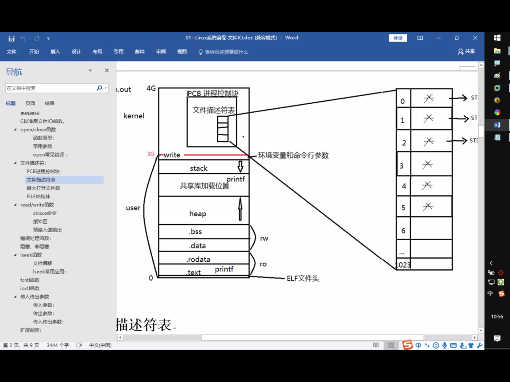
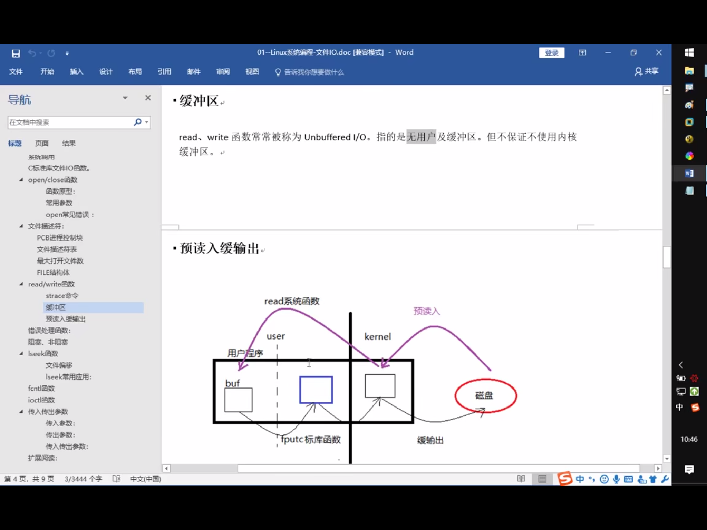

## I/O缓冲区

每一个FILE文件流都有一个缓冲区buffer，默认大小8192Byte。

write也不一定是直接写到文件的，也可能写到内核I/O缓冲区中，至于究竟写到了文件中还是内核缓冲区中对于进程来说是没有差别的.

如果进程A和进程B打开同一文件，进程A写到内核I/O缓冲区中的数据从进程B也能读到，而C标准库的I/O缓冲区则不具有这一特性 (todo why ???)

## open/close

int open(const char *pathname, int flags);

int open(const char *pathname, int flags, mode_t mode);

int close(int fd);

## 文件描述符

一个进程默认打开3个文件描述符

- STDIN_FILENO 0
- STDOUT_FILENO 1
- STDERR_FILENO 2

上限1203 -- 共1024个

新打开的文件描述符是可用的最小的那个

[open demo](../src/file/01_open.c)

## PCB

pcb task_struct结构体  

其中一个成员指针指向文件描述符表

文件描述符对应指向文件结构体的指针(成功打开的文件)，操作系统隐藏了指针的细节，只暴露了下标 -- files_struct结构体

里面成员是一系列文件信息

32位linux 

创建一个进程时，操作系统会为该进程分配一个 4GB 大小的虚拟进程地址空间。 之所以是 4GB ，是因为在 32 位的操作系统中，一个指针长度是 4 字节  （32位）， 2的32次 方个地址寻址能力是从 0x00000000~0xFFFFFFFF 即为 4GB 大小的容量。

4G 指的是最大的寻址空间为4G

一个进程用到的虚拟地址是由内存区域表来管理的，实际用不了4G。而用到的内存区域，会通过页表映射到物理内存。所以每个进程都可以使用同样的虚拟内存地址而不冲突，因为它们的物理地址实际上是不同的。

## **所有的系统函数都应该检查返回值**

perror

## read / write

ssize_t read(int fd, void *buf, size_t count);

[read/write实现cp](../src/file/02_mycp.c)

## 输入和输出

printf() and scanf()

getchar() & putchar() 

gets() & puts()

## 文件读写

fopen() and fclose()

fputc() and fputs()

fprintf() and fscanf

二进制 I/O 函数 fread() and fwrite()

strace(mac下为dtruss) ，跟踪程序

了解为什么fread/fwrite为什么要比系统调用read和write快(buf同设为1)

[对比实验getc](../src/file/03_getc_cmp_read.c)

[对比实验read](../src/file/03_read_cmp_getc.c)

从用户空间到内核很耗时

fputc函数有一个缓冲区(预读入缓输出)，凑够了4096再一起拷贝进内核缓冲区，而不是1个1个的进

read由于我们是把BUFSIZE设置成了1，所以每次1个就进内核空间

写入内核缓冲区则结束，什么时候刷入磁盘是os控制，在cpu空闲时刷入

标准IO函数自带用户缓冲区，系统调用无用户级缓冲。系统缓冲区是都有的。

优先使用库函数

## 阻塞/非阻塞

阻塞不是read / write的属性，而是设备、网络文件的属性

产生阻塞场景 : 读设备文件 / 网络文件 (读常规文件无阻塞概念)

[阻塞实验](../src/file/05_block_readtty.c)

[非阻塞实验](../src/file/06_nonblock_readtty.c)

## fcntl

在调用open时指定O_NONBLOCK标志。这里介绍另外一种办法，可以用
fcntl函数改变一个已打开的文件的属性，可以重新设置读、写、追加、非阻塞等标志（这
些标志称为File Status Flag），而不必重新open文件。

[fcntl](../src/file/08_fcntl.c)

