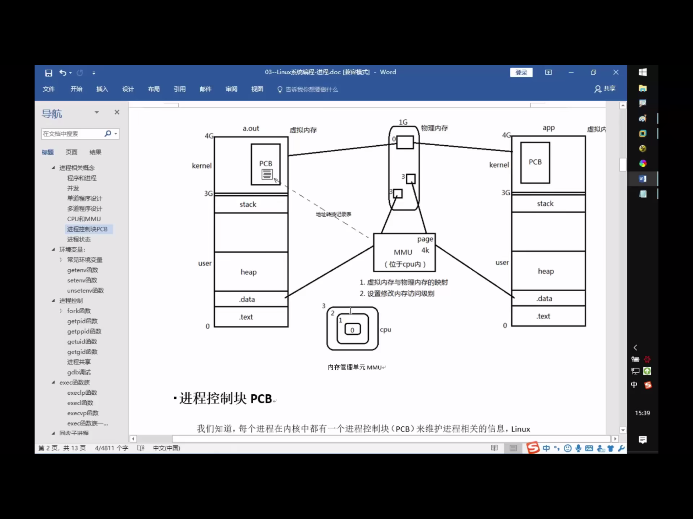
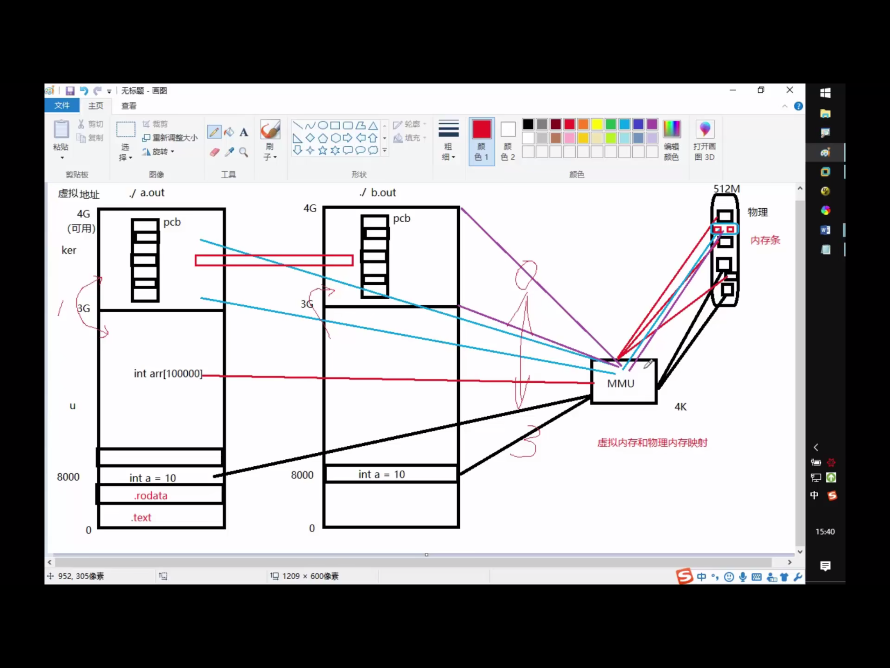
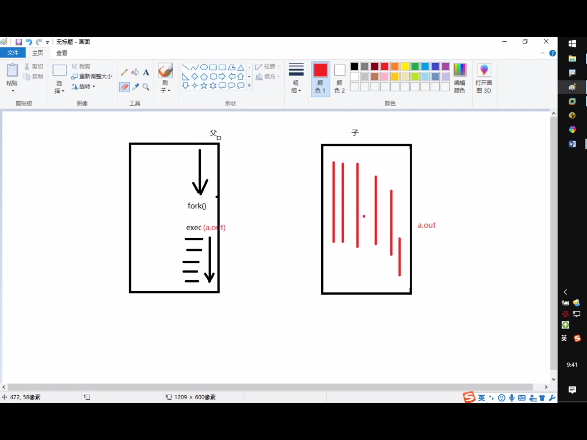
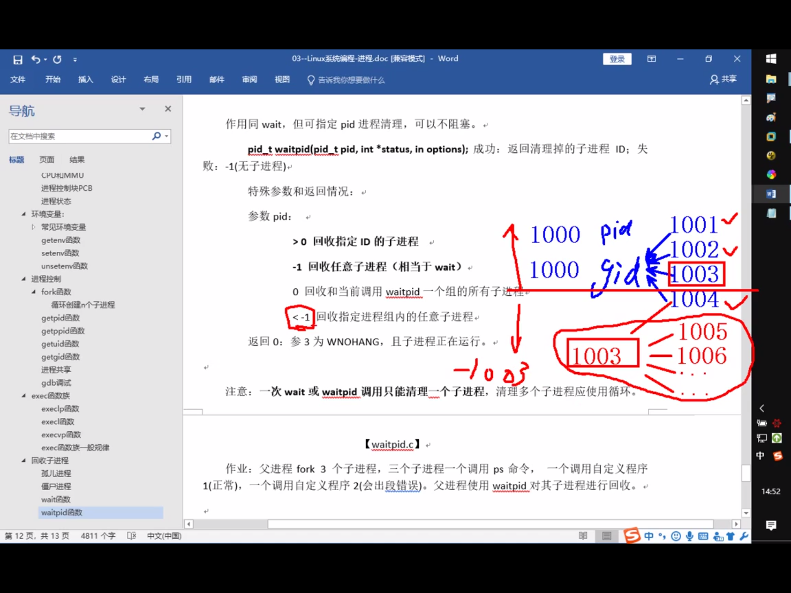

# 进程

- 区分进程和程序

程序:只占用磁盘空间

进程:运行起来的程序，占用内存，cpu等系统资源

2^32 = 4G 最大可用范围是4G

2^64 = ?

MMU : 虚拟内存映射单元  4KB




两个进程内都有一个int a,虚拟地址相同，但是通过MMU映射到不同的物理内存上，就避免了修改A进程导致B进程数据被修改

如果有一个arr[100000],没这么大的连续空间，可以在虚拟内存内连续，而映射到物理内存就是离散的

内核是操作系统，当前只有操作系统，只有一份内核，所以两个进程的内核映射到同一片物理内存

CPU将内存空间分0和3级两个级别

## pcb

/usr/src/linux-headers-5.0.0-29/include/linux/sched.h

struct task_struct

https://elixir.bootlin.com/linux/latest/source/include/linux/sched.h

PCB进程控制块 主要成员：

进程ID (ps aux, 唯一)

文件描述符表

进程状态：初始，就绪，运行，挂起，终止

进程工作目录位置

umask

信号相关信息资源

用户ID和组id

hint: 挂起，等待除了cpu以外的其他资源，主动放弃CPU

## 环境变量

LD_LIBRARY_PATH 动态链接器

PATH 可执行文件路径

//echo $PATH

SHELL 

//echo $SHELL

TERM

LANG

HOME

env 查看所有的环境变量

# 进程控制

## fork***

创建子进程

[fork](../src/process/01_fork.c)

父子进程格子返回，父进程返回子进程pid,子进程返回0

## getpid() / getppid();



## 循环共享

循环创建n个子进程

[loop fork](../src/process/02_loop_fork.c)

## 进程共享

父子进程之间在fork后，有哪些相同，哪些不同的地方？

- 相同：

刚fork后。data段，text段(代码段)，堆，栈，环境变量，全局变量，宿主目录位置，进程工作目录位置，信号处理方式

- 不同

进程id，返回值，各自的父进程id，进程运行的时间，闹钟(定时器)，未决信号集

## 

父子进程遵循读时共享写时复制    ------全局变量

父子进程共享：

1. 文件描述符(打开文件的结构体)

2. mmap建立的映射区(进程间通信详解)

特别的，fork之后父进程先执行还是子进程先执行不确定。取决于内核所使用的调度算法

## GDB专题(待)

## exec函数族

用fork创建子进程后执行的是和父进程相同的程序（但有可能执行不同的代码分支），
子进程往往要调用一种exec函数以执行另一个程序。当进程调用一种exec函数时，该进程的
用户空间代码和数据完全被新程序替换，从新程序的启动例程开始执行。调用exec并不创建
新进程，所以调用exec前后该进程的id并未改变。

```c
#include <unistd.h>
int execl(const char *path, const char *arg, ...);
int execlp(const char *file, const char *arg, ...);
int execle(const char *path, const char *arg, ..., char *const envp[]);
int execv(const char *path, char *const argv[]);
int execvp(const char *file, char *const argv[]);
int execve(const char *path, char *const argv[], char *const envp[]);
```

这些函数如果调用成功则加载新的程序从启动代码开始执行，不再返回，如果调用出错
则返回-1，所以exec函数只有出错的返回值而没有成功的返回值。

execlp 借助PATH环境变量寻找执行程序

execl 自己指定执行程序路径

execvp ...

，只有execve是真正的系统调用，其它五个函数最终都调用execve



将当前进程的.text,.data替换为所要加载的程序的.text,.data，然后让进程从新的.text第一条指令开始执行，但进程ID不变，换核不换壳

## 回收子进程

## 孤儿进程

孤儿进程：父进程先于子进程结束，则子进程成为孤儿进程，子进程的父进程成为init进程，称为init进程领养孤儿进程

ps aux

ps ajx

## 僵尸进程

进程终止，父进程尚未回收，子进程残留资源(PCB)存放在内核中，变成僵尸进程

特别注意，不能用kill清楚，kill命令只能用来终止进程，而僵尸进程以及停止。

Thinking:如何可清除僵尸进程？

杀死他的父亲

## wait()

pid_t wait(int* status)

参数： (传出)回收进程的状态

返回值

成功： 回收进程的pid

失败 : -1  errno

获取子进程正常终止值:

WIFEXITED(status) --> 为真 --> 调用WEXUTSTATUS(status) --> 得到子进程退出值

获取导致子进程异常终止信号:

WIFSIGNALED(status) --> 为真 --> 调用WTERMSIG(status) --> 得到导致子进程异常终止的信号编号

父进程调用wait函数可以回收子进程终止信息。改函数有三个功能

1. 阻塞等待子进程退出

2. 清理子进程残留在内核的PCB资源

3. 通过传出参数，获取子进程结束状态(退出原因)

kill -l 查看kill的信号

## waitpid()

可指定某一进程进行回收

pid_t waitpid(pid_t pid, int *status, int options)

args:

pid：指定回收的子进程pid

> 0 回收指定ID的子进程

-1 回收任意子进程（相当于wait)

0 回收和当前调用waitpid一个组的所有子进程

< -1 回收指定进程组内的任意子进程


status （传出）回收进程的状态

options WNOHANG 指定回收方式为非阻塞

return value:

    > 0 : 表示成功回收的子进程pid

    0 : 函数调用时,第三个参数指定WNOHANG,并且没有子进程结束

    -1 : fail, errno



总结：wait，waitpid 一次调用，回收一个子进程

想回收多个，while

waitpid(-1, &status, 0) == wait(&status)

## 进程之间通信

InterProcess Communication


进程间通信常用方式

管道：简单

信号：开销小

mmap映射：非血缘关系进程间

socket(本地套接字):稳定