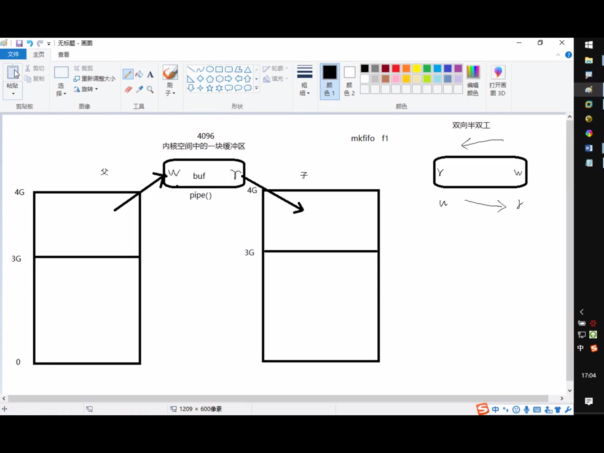
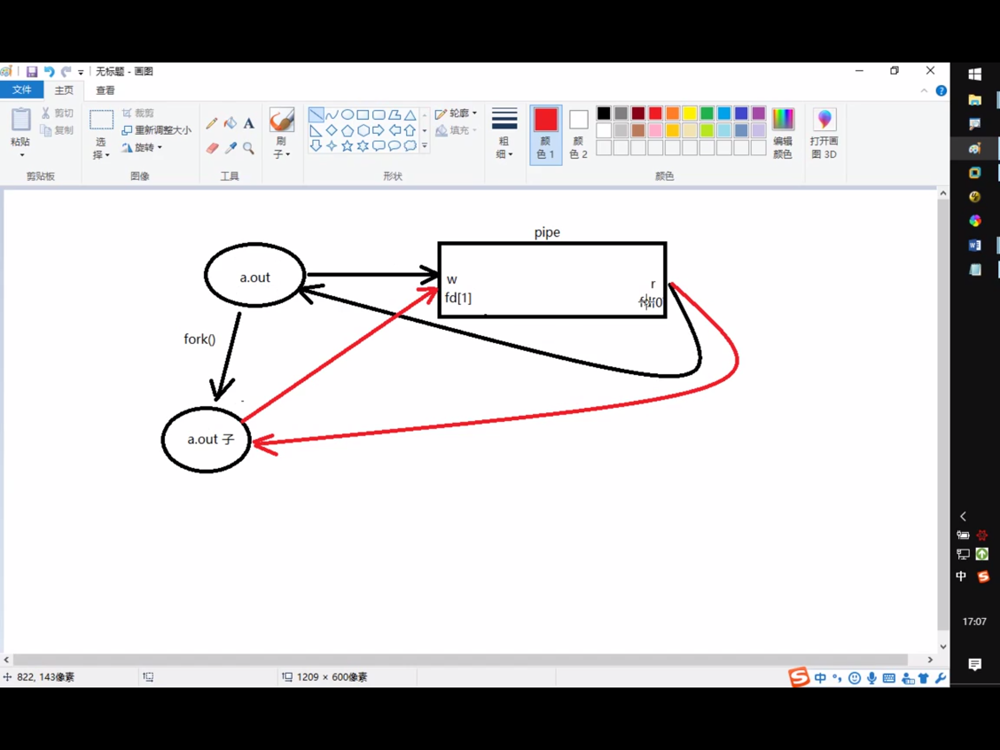
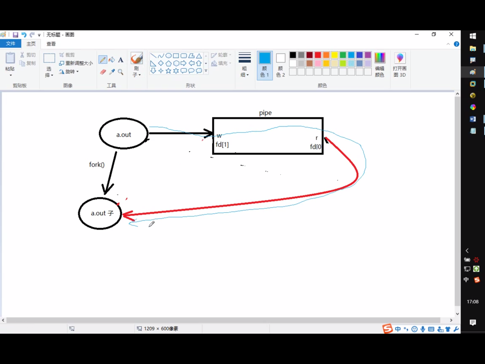

## 进程之间通信

InterProcess Communication

进程间通信常用方式

管道：简单

信号：开销小

mmap映射：非血缘关系进程间

socket(本地套接字):稳定

## 管道

实现原理:内核借助环形队列机制，使用内核缓冲区实现。

特质：

1. 伪文件

2. 管道中的数据只能一次读取

3. 数据在管道中只能单向流动

局限性：

1. 自己写，不能自己读

2. 数据不可以反复读

3. 半双工通信

4. 血缘关系进程间可用

## pipe()

**用于有血缘关系的进程间通信**

ps aux|grep

ls|wc -l

创建并打开管道

int pipe(int fd[2])

参数: fd[0]:读端
     fd[1]:写端

返回值 。。。。

## 管道的读写行为

- 读管道：

1. 管道有数据，read返回实际读到的字节数

2. 管道无数据。

1）无写端，read返回0（类似读到文件尾）

2）有写端，read阻塞等待

- 写管道

1. 无读端，异常终止。(SIGPIPE导致的)

2. 有读端 

1)管道已满，阻塞等待

ulimit -a 可以查pipe缓冲区大小(pipe size)

利用fpathconf函数，借助参数选项来查看

- demo:

ls-wc-l.c

pipe_bro.c

## FIFO

命名管道 mkfifo(指令、函数）

无血缘关系进程间通信

读端: open fifo O_RDONLY

写端: open fifo O_WRONLY

- DEMO 

fifo_r.c

fifo_w.c

## 文件进程间通信

打开的文件是内核中的一块缓冲区。多个无血缘关系的进程，可以同时访问该文件。

## 存储映射IO

### mmap

void* mmap(void *addr, size_t len, int prot, int flags, int fd,off_t offset);

作用： 创建共享内存映射

参数：
    addr: 指定映射区的首地址，通常传NULL，表示让系统自动分配

    len: 共享内存映射区的大小, (<=文件的实际大小>)
    
    prot: 共享内存映射区的读写属性。PROT_READ/PORT_WRITE
    
    flags:标注共享内存的共享属性。MAP_SHARED/MAP_PRIVATE(shared修改可以反映到磁盘上)
    
    fd: 用于创建共享内存映射区的那个文件的文件描述符
    
    offset: 默认0，表示映射文件全部。偏移位置。4k的整数倍

返回值：
    成功：映射区的首地址
    
    失败：MAP_FAILED((void*)(-1)), errno

int munmap(void *addr, size_t len);  // 释放映射区

参数： 

addr: mmap的返回值

## mmap的注意事项****

Thinking: 

1. 可以open的时候O_CREAT一个新文件来创建映射区吗

用于创建映射区的文件大小为0，实际指定非0大小创建映射区，出总线(BUS)错误

2. 用于创建映射区的文件大小为0，实际制定0大小创建映射区，出"无效参数"

3. 如果open时O_RDONLY,mmap时PROT参数指定的是PROT_READ|PROT_WRITE会如何

无效参数

open 为O_RDONLY, mmap时PROT参数指定的是PROT_READ

如果是段错误，gdb 然后run，停止的地方就是段错误

但是这里我们是bus错误怎么回事？未解决

**创建映射区，需要read权限，当访问权限指定为共享时，mmap需要读写权限，应该<=文件的open权限**

4. 文件描述符先关闭，对mmap映射有没有影响

fd在创建映射区完成即可关闭，后续访问文件用地址访问

5. 如果文件偏移量是1000会如何

offset必须是4096的整数倍，原因与MMU有关，MMU映射的最小单位是4K

（MMU是Memory Management Unit的缩写，中文名是内存管理单元

6. 对mem越界操作会怎么样

也就是对p进行越界操作

对申请的映射区内存，不能越界访问，

7. 如果mem++,munmap可否成功

munmap用于释放的地址一定是mmap申请的地址

8. 如果不检测mmap的返回值，会怎样

9. mmap什么时候会调用失败

上面测试了各个参数的情况

10. 映射区访问权限为“私有”, 对内存所做的所有修改，只在内存有效，不会反映到物理磁盘上。

11. 映射区访问权限为私有时，只需要open文件时，有读权限，用于创建映射区即可

## mmap函数的保险调用方式

1. fd = open("filename", O_RDWR)

2. mmap(NULL, 有效文件大小, PROT_READ|PROT_WRITE, MAP_SHARED, FD, 0);

## mmap 父子间通信

父进程先创建映射区 open(O_RDWR) mmap()

指定MAP_SHARED 权限

fork()创建子进程

一个进程读，一个进程写

## mmap非血缘关系进程间通信

两个进程打开同一个文件，创建映射区

指定flags为MAP_SHARED

一个进程写入，另一个进程读出

注意：无血缘关系进程间通信：

mmap:数据可以重复读取

fifo:数据只能读一次

## mmap匿名映射区

只能用于学院关系

mmap(NULL, len, PROT_READ|PROT_WRITE, MAP_SHARED|MAP_ANON, -1, 0);

对于老的unix系统

/dev/zero -> "\0"

/dev/null 文件黑洞