## 信号

信号共性:

简单，不能携带大量信息，满足条件才发送

信号的特质:

信号是软件层面上的"中断"，一旦信号中断，无论程序执行到什么位置，必须停止运行，处理信号，处理结束，再继续执行后续指令

所有信号的产生和处理全部都是由“内核”完成的

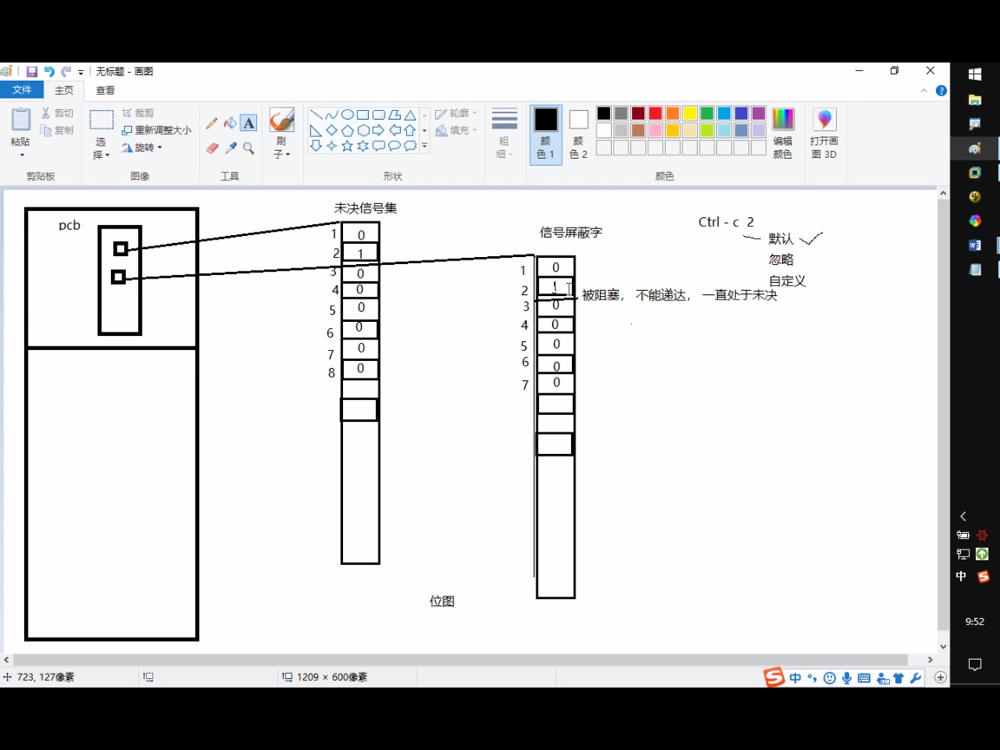


信号相关的概念：

产生信号:

1. 按键产生

2. 系统调用产生

3. 软件条件产生

4. 硬件异常产生

5. 命令产生

概念：

未决：产生与递达之间状态

递达: 产生并且送达到进程，直接被内核处理掉

信号处理方式：执行默认处理动作，忽略，捕捉(自定义)

阻塞信号集(信号屏蔽字): 本质：位图。 用来记录信号的屏蔽状态，一旦被屏蔽的信号，在解除屏蔽前，一直处于未决态

未决信号集: 本质:位图 用于记录信号的处理状态，该信号集中的信号表示已经产生，但尚未被处理

## 信号四要素/常规信号

信号四要素(信号使用之前一定要先确认)

1. 编号

2. 名称

3. 信号对应事件

4. 默认处理动作

## KILL

kill -9 pid 

kill -9 -pid是kill掉整个组进程

9:SIGKILL

kill -- send signal to a process

int kill(pid_t pid, int sig);

pid: > 0 发哦信号给指定进程

    = 0 发送信号给调用kill函数的那个进程处于同一进程组的进程

    < -1 取绝对值，发送信号给该绝对值所对应的进程组的所有组员

    = -1 发送信号给，有权限发送的所有进程


## alarm 

使用的自然计时法

定时发送SIGALRM给当前进程

unsigned alarm(unsigned seconds);

params:

    seconds:定时秒数

return value:

    上次定时剩余时间，无错误现象

每个进程都有且只有一个定时器(多次调用会重置)

time命令查看程序执行时间

time ./alarm (>a.out)

实际执行时间 = 系统时间 + 用户时间 + 等待时间

程序运行的瓶颈在于IO

alarm(0) 取消闹钟

## setitimer

int setitimer(int which, const struct itimerval *restrict value,
    struct itimerval *restrict ovalue);

Parmas:

which: ITIMER_REAL :采样自然计时  --> SIGALRM

       ITIMER_VIRTUA : 用户空间计时 --> SIGVTALRM

       ITIMER_PRO : 采用内核 + 用户空间计时 --> SIGPROF

类型

struct itimerval {
        struct  timeval it_interval;    /* timer interval 周期定时秒数*/
        struct  timeval it_value;       /* current value 第一次定时秒数*/
};

struct timeval {
    time_t tv_sec;   /* seconds */
    suseconds_t tv_usec;  /* microseconds */
}

restrict value: 定时秒数

restrict ovalue: 传出参数，上次定时剩余时间

e.g.
```c
struct itimerval new_t;
struct itimerval old_t;
new_t.it_interval.tc_sec = 1;
new_t.it_interval.tv_usec = 0;
new_t.it_value.tv_sec = 0;
new_t.it_value.tv_usec = 0;
setitimer(&new_t, &old_t)
```

## 其他发信号的几个函数

int raise(int sig);

void abort(void);

## 信号集操作函数

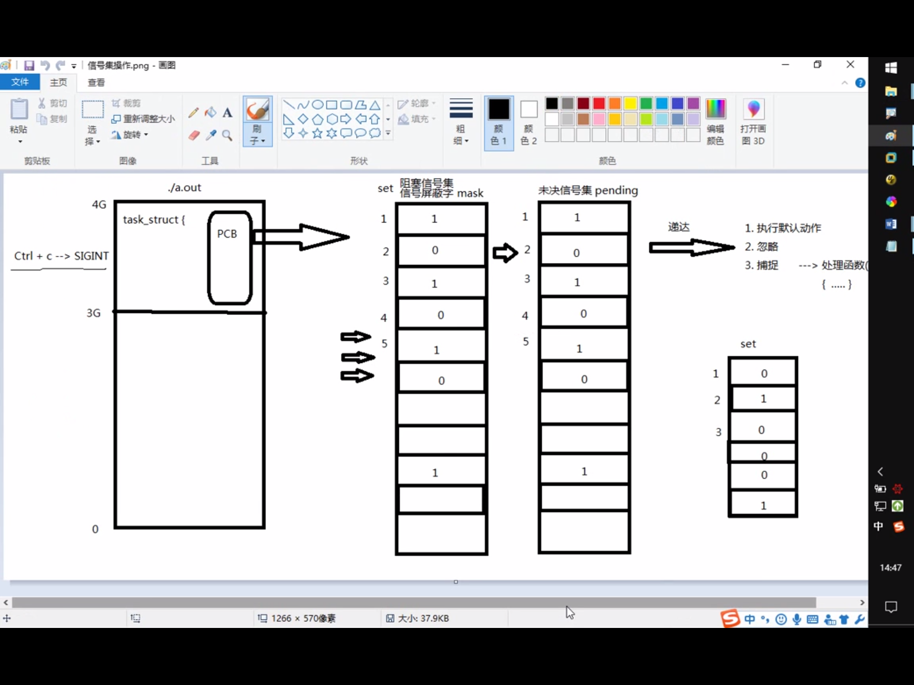

信号集操作函数：

sigset_t set; 自定义信号集

sigemptyset(sigset_t *set); 清空信号集

sigfillset(sigset_t *set); 全部置1

sigaddset(sigset_t *set, int signum); 将一个信号添加到集合中

sigdelset(sigset_t *set, int signum); 将一个信号从集合中移除

sigismember(const sigset *set, int signum); 判断一个信号是否在集合中，在返回1，不在返回0

## 设置信号屏蔽字和解除屏蔽:


int sigprocmask(int how, const sigset_t *restrict set,
    sigset_t *restrict oset);

params:

how: 
    SIG_BLOCK 设置阻塞

    SIG_UNBLOCK  取消阻塞

    SIG_SETMASK  用自定义的set替换mask

set:自定义set

oset:旧有的mask

## 查看未决信号集

int sigpending(sigset_t *set);

set:传出的未决信号集

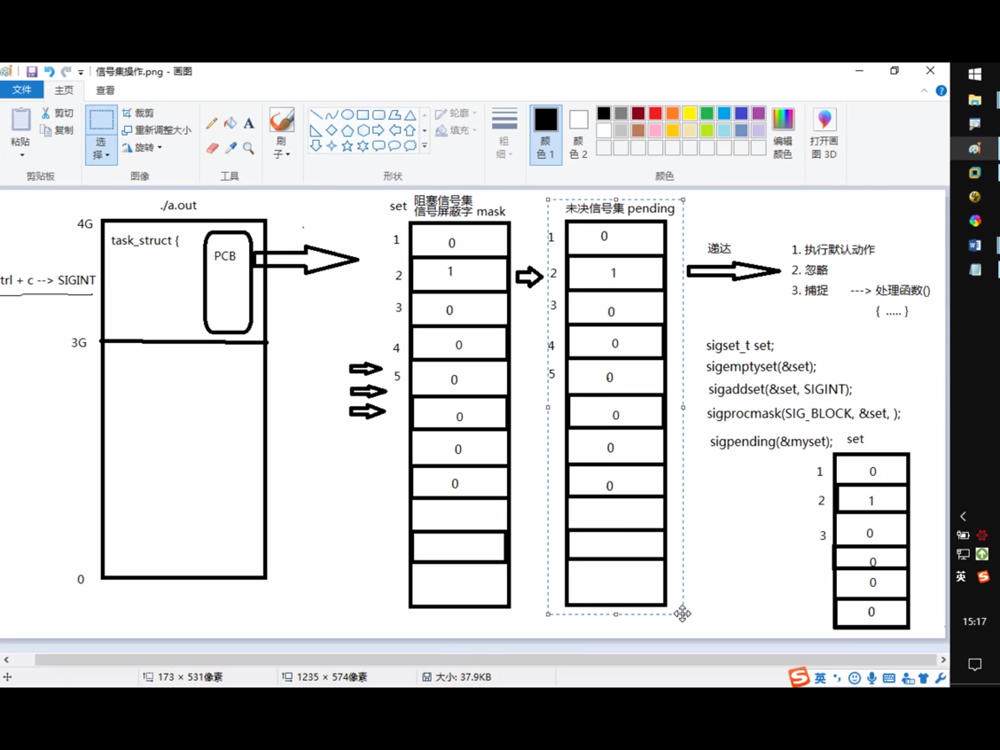

注意ctrl D不是发信号

## 信号捕捉

### siganl 

### sigaction 

### 信号捕捉特性

1. 捕捉函数执行期间，信号字由mask -> sa_mask, 捕捉函数执行结束恢复回mask

2. 捕捉函数执行期间，本信号自动被屏蔽(sa_flags = 0)

3. 捕捉函数执行期间,被屏蔽信号多次发送，接触屏蔽后只处理一次(不支持排队)

## 内核实现信号捕捉过程

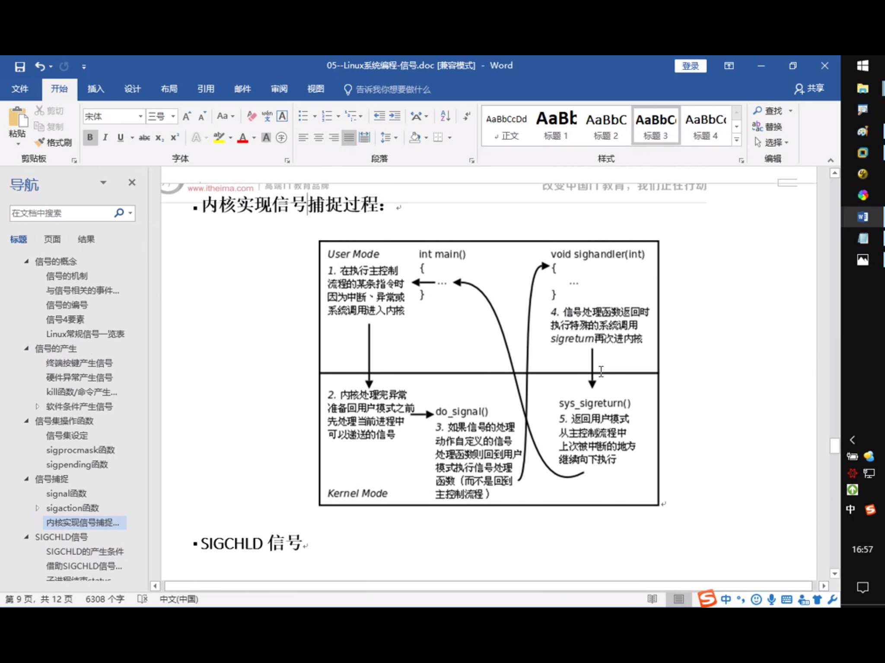

## SIGCHILD

## 会话

session.c

## 守护进程(Daemon)

通常运行于操作系统后台，脱离控制终端，一般不与用户直接交互，周期性的等待某个事件发生或周期性执行某一动作。

不受用户登录注销影响，通常以d结尾的命名方式，httpd,sftpd...

### 守护进程创建步骤

1. fork子进程，让父进程终止

2. 子进程调用setsid()创建新会话

3. 通常根据需要，改变工作目录位置 chdir()

4. 通常根据需要，重设umask文件权限掩码。 影响新文件的创建权限  022 - 755

5. 通常根据需要，关闭/重定向 文件描述符

6. 守护进程 业务逻辑 while()


## 三级映射

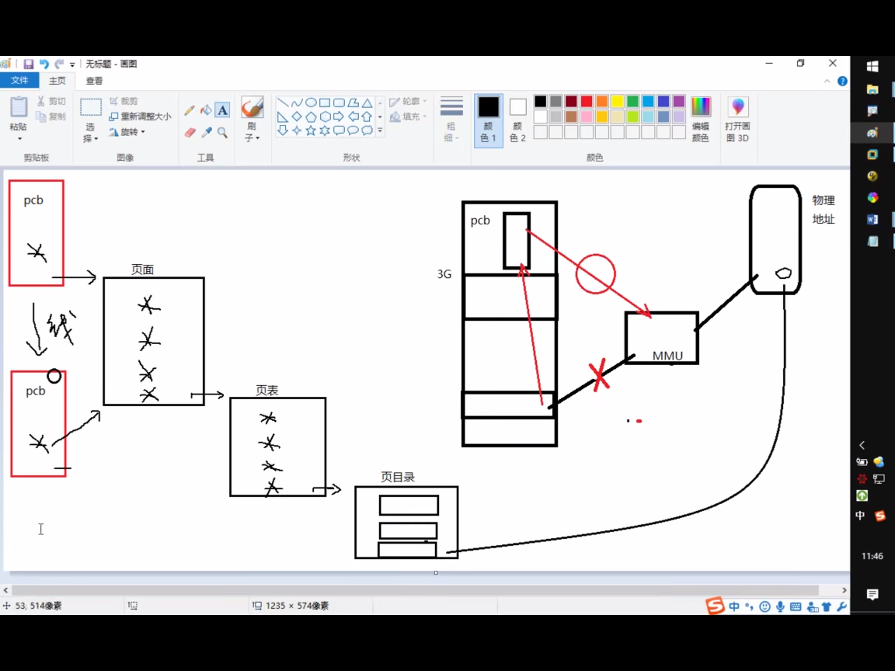


## 线程

进程： 有独立的 进程地址空间，有独立的pcb ，分配资源的最小单位

线程: 有独立的pcb， 没有独立的进程地址空间


ps -Lf pid   ----> 线程号 LWP ---> cpu执行的最小单位

线程共享：

独享 栈空间(内核栈，用户栈)

共享 ./text ./data ./rodate ./bss heap --> 全局变量 / errno

**线程ID 和 LWP 线程号不一样**

线程ID用于进程内区分线程

LWP 标识线程身份给cpu用的

## 线程控制原语

pthread_t pthread_self(void); 

获取线程id，线程id是进程地址空间内部，用来标识线程身份的id号

返回值: 本线程id

--------------------------

int pthread_create(pthread_t *thread, const pthread_attr_t *attr,
         void *(*start_routine)(void *), void *arg);

params:

参1：传出参数，表新创建的子线程id

参2：线程属性，传NULL表使用默认属性

参3：子线程回调函数。创建成功，pthread_create函数返回时，该回调函数自动调用

参4：参3的参数，无的话传NULL

返回：成功 0 失败 errno

### 循环创建多个子线程

--------------------------

void pthread_exit(void *retval);

retval : 退出值， 无退出值时，NULL

exit() 退出当前进程

return 返回到调用者

pthread_exit()  退出当前线程

--------------------------

pthread_join : wait for thread termination

--------------------------

int pthread_cancel(pthread_t thread); 

杀死一个线程，需要到达一个取消点(保存点)

如果子线程没遇到到达保存点，pthread_cancel无效

我们可以在程序中，手动添加一个取消点，使用
**pthread_testcancel()**

成功被pthread_cancel()杀死的线程，返回-1,使用pthread_join回收

--------------------------

int pthread_detach(pthread_t thread);

detach a thread 设置线程分离

检查出错返回：

**一定记住，在线程中不要用perror**

**用fprintf(stderr,"xxxx:%s\n", strerror(ret));**

### 线程与进程原语对比

线程控制原语 ------------------进程控制原语

pthread_create()  -----------fork()

pthread_self()    -----------getpid()

pthread_exit()     ----------exit()

pthread_join      -----------wait()/waitpid()

pthread_cancel   ------------kill()

pthread_detach

## 线程属性设置

设置分离属性，

pthread_attr_t attr;   创建一个线程属性结构体变量

pthread_attr_init(&attr);

// set

pthread_attr_setdetachstate(&attr, PTHREAD_CREATE_DETACHED);

// create

pthread_create(&tid, &attr, tfn, NULL);

pthread_attr_destroy(&attr);

## 线程使用注意事项

1. 主线程退出其他线程不提出，主线程应该调用 pthread_exit

2. 避免僵尸线程

pthread_join 

pthread_detach 

pthread_create 指定分离属性

3. malloc和mmap申请的内存可以被其他线程释放(共享堆区)

4. 应避免在多线程模型中调用fork除非，马上exec,子进程中只有调用fork的线程存在，其他线程在子进程中均pthread_exit

5. 信号的复杂语义很难和多线程共存，应避免在多线程引入信号机制

## 线程同步

协同步调，对公共区域数据按序访问，防止数据混乱，产生时间有关的错误

锁的使用：建议锁！对公共数据进行保护。所有线程(应该)在访问公共数据前先拿锁再访问，但锁不具备强制性

使用mutex(互斥量/互斥锁)

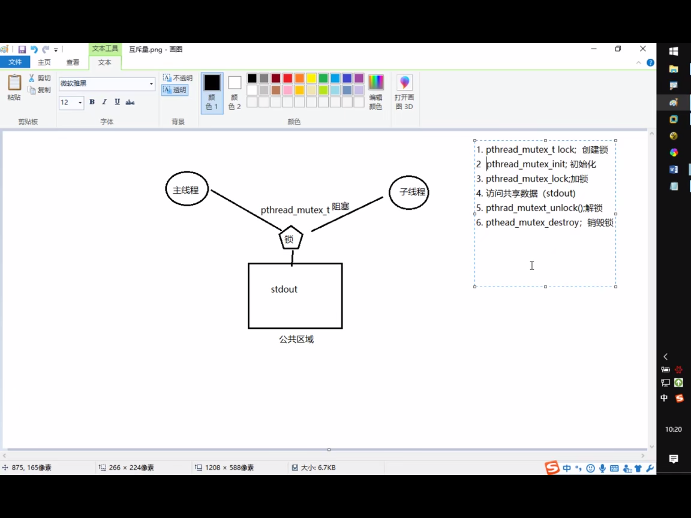

restrict 是个关键字，限制指针变量，被该关键字限定的指针变量所指向的内存操作，必须由本指针完成

注意:**尽量保证锁的粒度越小越好(访问共享数据前，加锁，访问结束立即解锁)**

互斥锁，本质是结构体，我们可以看整数，初值为1， (pthread_mutex_init()函数调用成功)

加锁： --操作， 阻塞线程

解锁： ++操作， 唤醒阻塞在锁上的线程

try锁， 尝试加锁，成功--， 失败，返回，同时设置错误号为EBUSY

## 死锁

是使用锁不恰当导致的现象

1. 线程试图对同一个互斥量A加锁两次

2. 线程1拥有A锁，请求获得B锁，线程2拥有B锁，请求获得A锁

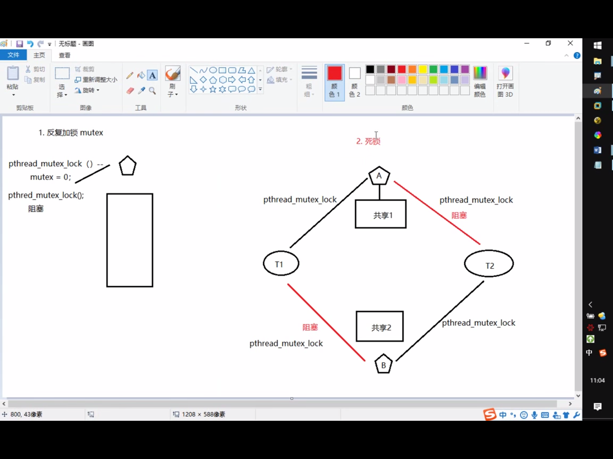

## 读写锁

1. 读共享，写独占

2. 写锁优先级高

3. 锁只有一把，以读方式给数据加锁 -- 读锁 ， 写同理

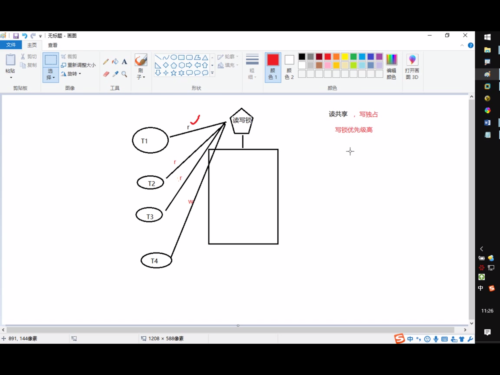

相较于互斥量而言，当读线程多时，提高访问效率

pthread_rwlock_t rwlock;

pthread_rwlock_init(&rwlock, NULL);

pthread_rwlock_rdlock(&rwlock);  try版本

pthread_rwlock_wrlock(&rwlock);  try版本

pthread_rwlock_unlock(&rwlock);

pthread_rwlock_detroy(&rwlock);

## 条件变量

本身不是锁，但是通常结合锁来使用, mutex

pthread_cond_t cond;

初始化条件变量:

1. pthread_cond_init(&cond, NULL);  动态初始化

2. pthread_cond_t cond = PTHREAD_COND_INITIALIZER; 静态初始化

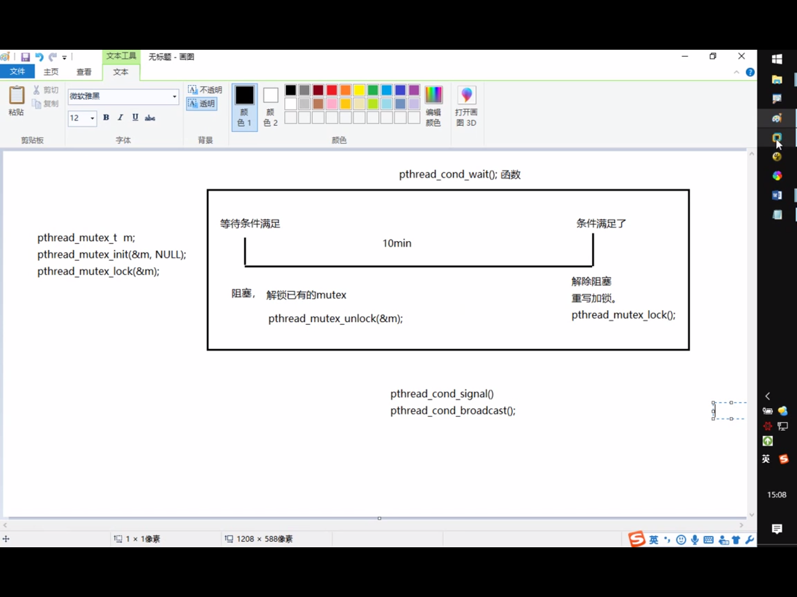

## 生产者和消费者模型

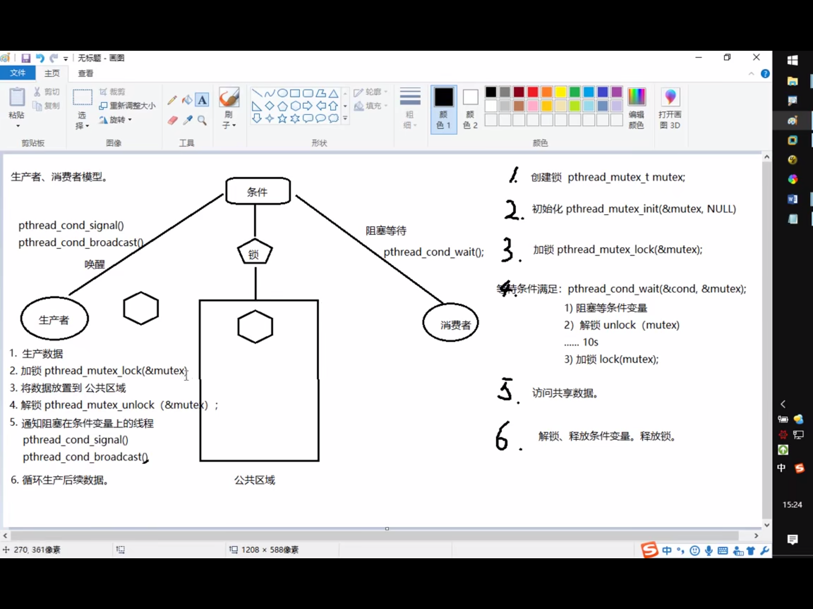


## 信号量

用于线程，进程间同步

相当于 初始化为N的互斥量 ， N值可以同时访问共享数据区的线程数

函数:

sem_t sem; 定义类型

int sem_init(sem_t *sem, int pshared, unsigned int value);

参数:

sem: 信号量

pshared: 0 : 用于线程间同步 

        non-zero: 用于进程间同步
        
        value: N值，指定同时访问的线程数

sem_destroy()

sem_wait()   一次调用，做一次 -- 操作，当信号量为0时，再次 -- 就会阻塞，(对比 pthread_mutex_lock)

sem_post()  一次调用，做一次 ++ 操作，当信号量为N时，再次 ++ 就会阻塞(对比pthread_mutex_unlock)

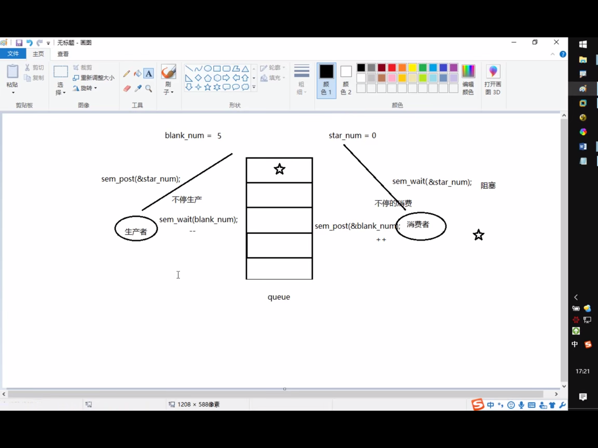

