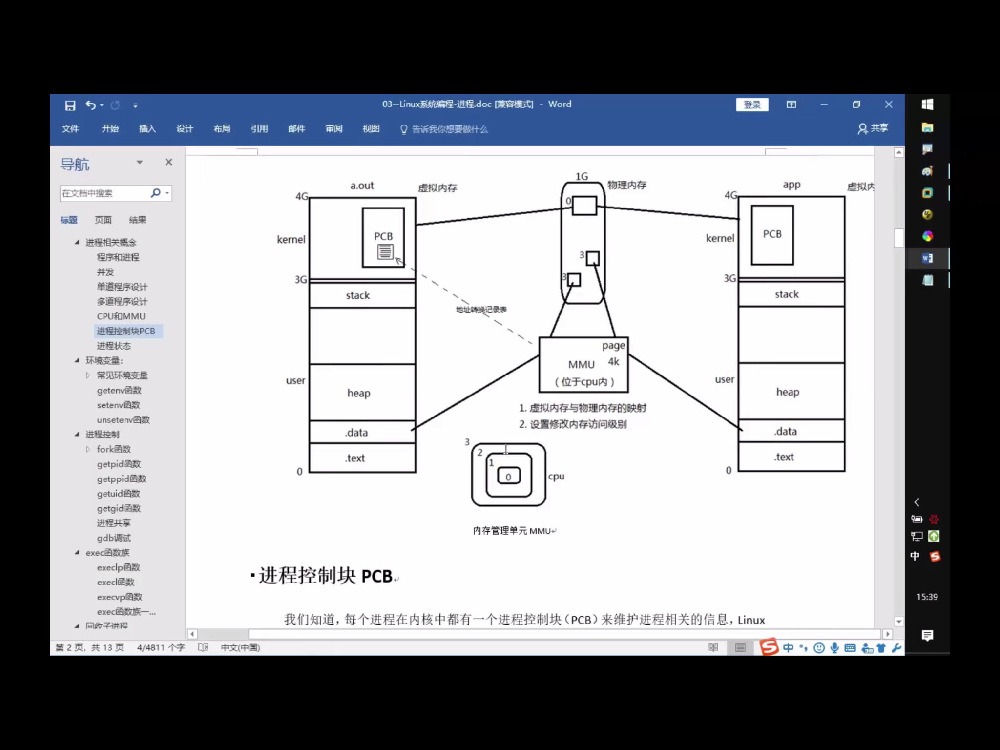
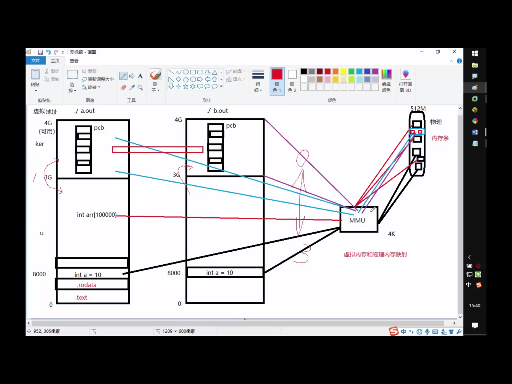
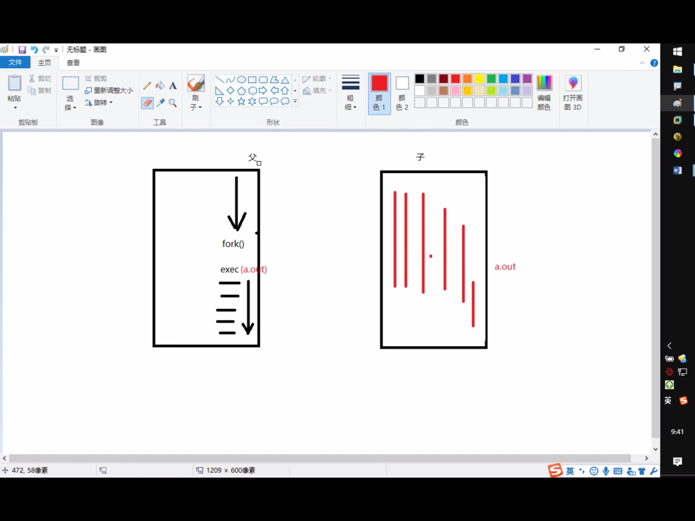
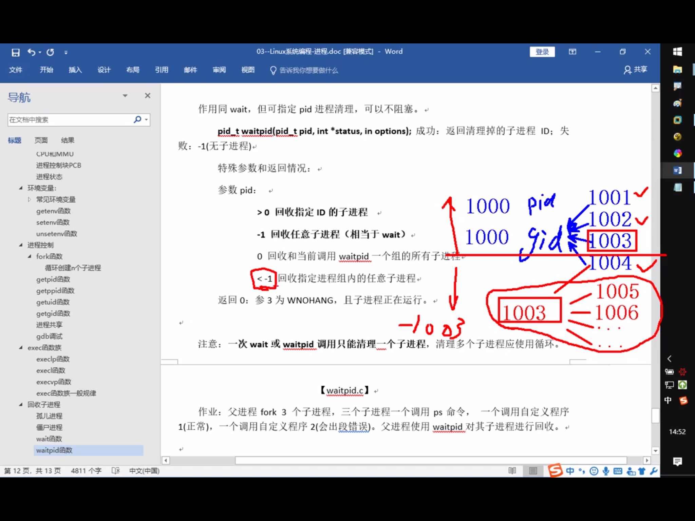
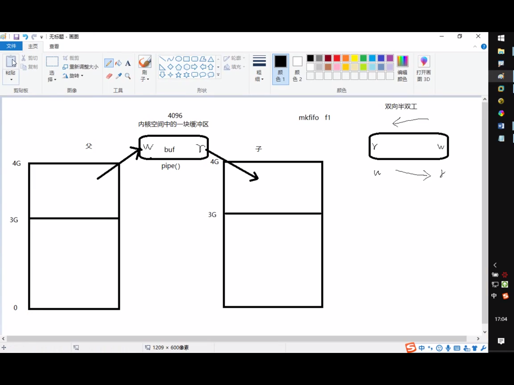
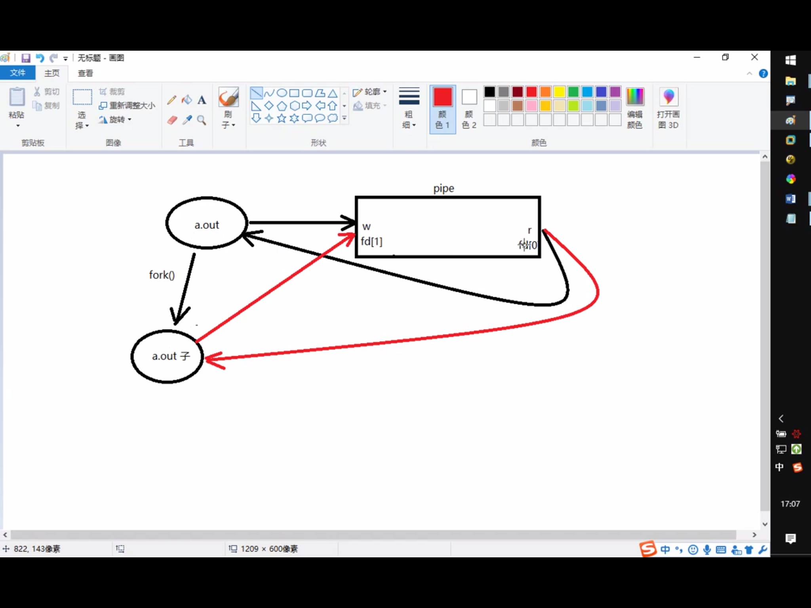
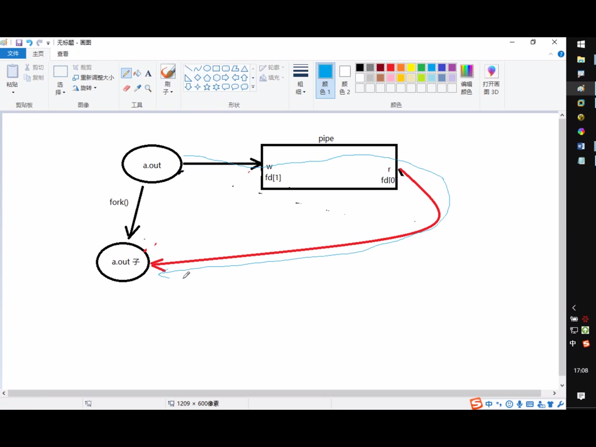

# 进程

- 区分进程和程序

程序:只占用磁盘空间

进程:运行起来的程序，占用内存，cpu等系统资源

MMU : 虚拟内存映射单元





## pcb

/usr/src/linux-headers-5.0.0-29/include/linux/sched.h

struct task_struct

PCB进程控制块：

进程ID

文件描述符表

进程状态：初始，就绪，运行，挂起，终止

进程工作目录位置

umask

信号相关信息资源

用户ID和组id

## 环境变量

LD_LIBRARY_PATH 动态链接器

PATH 可执行文件路径

//echo $PATH

SHELL 

//echo $SHELL

TERM

LANG

HOME

env 查看所有的环境变量

# 进程控制

## fork***

创建子进程

父子进程格子返回，父进程返回子进程pid,子进程返回0

## getpid() / getppid();


## 循环共享

循环创建n个子进程

## 进程共享

父子进程之间在fork后，有哪些相同，哪些不同的地方？

- 相同：

刚fork后。data段，text段(代码段)，堆，栈，环境变量，全局变量，宿主目录位置，进程工作目录位置，信号处理方式

- 不同

进程id，返回值，各自的父进程，进程创建的时间，闹钟，未决信号集

## 

父子进程遵循读时共享写时复制    ------全局变量

父子进程共享：

1. 文件描述符(打开文件的结构体)

2. mmap建立的映射区(进程间通信详解)


特别的，fork之后父进程先执行还是子进程先执行不确定。取决于内核所使用的调度算法

## GDB专题(待)

## exec函数族

就是使进程执行某一程序，成功无返回值，失败返回-1

execlp 借助PATH环境变量寻找执行程序

execl 自己指定执行程序路径

execvp ...



将当前进程的.text,.data替换为所要加载的程序的.text,.data，然后让进程从新的.text第一条指令开始执行，但进程ID不变，换核不换壳

## 回收子进程

## 孤儿进程

孤儿进程：父进程先于子进程结束，则子进程成为孤儿进程，子进程的父进程成为init进程，称为init进程领养孤儿进程

ps aux

ps ajx

## 僵尸进程

进程终止，父进程尚未回收，子进程残留资源(PCB)存放在内核中，变成僵尸进程

特别注意，不能用kill清楚，kill命令只能用来终止进程，而僵尸进程以及停止。

Thinking:如何可清除僵尸进程？

杀死他的父亲

## wait()

pid_t wait(int* status)

参数： (传出)回收进程的状态

返回值

成功： 回收进程的pid

失败 : -1  errno

获取子进程正常终止值:

WIFEXITED(status) --> 为真 --> 调用WEXUTSTATUS(status) --> 得到子进程退出值

获取导致子进程异常终止信号:

WIFSIGNALED(status) --> 为真 --> 调用WTERMSIG(status) --> 得到导致子进程异常终止的信号编号

父进程调用wait函数可以回收子进程终止信息。改函数有三个功能

1. 阻塞等待子进程退出

2. 清理子进程残留在内核的PCB资源

3. 通过传出参数，获取子进程结束状态(退出原因)

kill -l 查看kill的信号

## waitpid()

可指定某一进程进行回收

pid_t waitpid(pid_t pid, int *status, int options)

args:

pid：指定回收的子进程pid

> 0 回收指定ID的子进程

-1 回收任意子进程（相当于wait)

0 回收和当前调用waitpid一个组的所有子进程

< -1 回收指定进程组内的任意子进程


status （传出）回收进程的状态

options WNOHANG 指定回收方式为非阻塞

return value:

    > 0 : 表示成功回收的子进程pid

    0 : 函数调用时,第三个参数指定WNOHANG,并且没有子进程结束

    -1 : fail, errno



总结：wait，waitpid 一次调用，回收一个子进程

想回收多个，while

waitpid(-1, &status, 0) == wait(&status)

## 进程之间通信

InterProcess Communication



进程间通信常用方式

管道：简单

信号：开销小

mmap映射：非血缘关系进程间

socket(本地套接字):稳定

## 管道

实现原理:内核借助环形队列机制，使用内核缓冲区实现。

特质：

1. 伪文件

2. 管道中的数据只能一次读取

3. 数据在管道中只能单向流动

局限性：

1. 自己写，不能自己读

2. 数据不可以反复读

3. 半双工通信

4. 血缘关系进程间可用

## pipe()

**用于有血缘关系的进程间通信**

ps aux|grep

ls|wc -l

创建并打开管道

int pipe(int fd[2])

参数: fd[0]:读端
     fd[1]:写端

返回值 。。。。






## 管道的读写行为

- 读管道：

1. 管道有数据，read返回实际读到的字节数

2. 管道无数据。

1）无写端，read返回0（类似读到文件尾）

2）有写端，read阻塞等待


- 写管道

1. 无读端，异常终止。(SIGPIPE导致的)

2. 有读端 

1)管道已满，阻塞等待


ulimit -a 可以查pipe缓冲区大小(pipe size)

利用fpathconf函数，借助参数选项来查看

- demo:

ls-wc-l.c

pipe_bro.c

## FIFO

命名管道 mkfifo(指令、函数）

无血缘关系进程间通信

读端: open fifo O_RDONLY

写端: open fifo O_WRONLY

- DEMO 

fifo_r.c

fifo_w.c

## 文件进程间通信

打开的文件是内核中的一块缓冲区。多个无血缘关系的进程，可以同时访问该文件。

## 存储映射IO

### mmap

void* mmap(void *addr, size_t len, int prot, int flags, int fd,off_t offset);

作用： 创建共享内存映射

参数：
    addr: 指定映射区的首地址，通常传NULL，表示让系统自动分配
    len: 共享内存映射区的大小, (<=文件的实际大小>)
    prot: 共享内存映射区的读写属性。PROT_READ/PORT_WRITE
    flags:标注共享内存的共享属性。MAP_SHARED/MAP_PRIVATE(shared修改可以反映到磁盘上)
    fd: 用于创建共享内存映射区的那个文件的文件描述符
    offset: 默认0，表示映射文件全部。偏移位置。4k的整数倍

返回值：
    成功：映射区的首地址
    失败：MAP_FAILED((void*)(-1)), errno


int munmap(void *addr, size_t len);  // 释放映射区

参数： 

addr: mmap的返回值

## mmap的注意事项****

Thinking: 

1. 可以open的时候O_CREAT一个新文件来创建映射区吗

用于创建映射区的文件大小为0，实际指定非0大小创建映射区，出总线(BUS)错误

2. 用于创建映射区的文件大小为0，实际制定0大小创建映射区，出"无效参数"

3. 如果open时O_RDONLY,mmap时PROT参数指定的是PROT_READ|PROT_WRITE会如何

无效参数

open 为O_RDONLY, mmap时PROT参数指定的是PROT_READ

如果是段错误，gdb 然后run，停止的地方就是段错误

但是这里我们是bus错误怎么回事？未解决

**创建映射区，需要read权限，当访问权限指定为共享时，mmap需要读写权限，应该<=文件的open权限**

4. 文件描述符先关闭，对mmap映射有没有影响

fd在创建映射区完成即可关闭，后续访问文件用地址访问

5. 如果文件偏移量是1000会如何

offset必须是4096的整数倍，原因与MMU有关，MMU映射的最小单位是4K

（MMU是Memory Management Unit的缩写，中文名是内存管理单元

6. 对mem越界操作会怎么样

也就是对p进行越界操作

对申请的映射区内存，不能越界访问，

7. 如果mem++,munmap可否成功

munmap用于释放的地址一定是mmap申请的地址

8. 如果不检测mmap的返回值，会怎样

9. mmap什么时候会调用失败

上面测试了各个参数的情况

10. 映射区访问权限为“私有”, 对内存所做的所有修改，只在内存有效，不会反映到物理磁盘上。

11. 映射区访问权限为私有时，只需要open文件时，有读权限，用于创建映射区即可

## mmap函数的保险调用方式

1. fd = open("filename", O_RDWR)

2. mmap(NULL, 有效文件大小, PROT_READ|PROT_WRITE, MAP_SHARED, FD, 0);

## mmap 父子间通信

父进程先创建映射区 open(O_RDWR) mmap()

指定MAP_SHARED 权限

fork()创建子进程

一个进程读，一个进程写

## mmap非血缘关系进程间通信

两个进程打开同一个文件，创建映射区

指定flags为MAP_SHARED

一个进程写入，另一个进程读出

注意：无血缘关系进程间通信：

mmap:数据可以重复读取

fifo:数据只能读一次

## mmap匿名映射区

只能用于学院关系

mmap(NULL, len, PROT_READ|PROT_WRITE, MAP_SHARED|MAP_ANON, -1, 0);

对于老的unix系统

/dev/zero -> "\0"

/dev/null 文件黑洞

## 信号

信号共性:

简单，不能携带大量信息，满足条件才发送

信号的特质:

信号是软件层面上的"中断"，一旦信号中断，无论程序执行到什么位置，必须停止运行，处理信号，处理结束，再继续执行后续指令

所有信号的产生和处理全部都是由“内核”完成的


信号相关的概念：

产生信号:

1. 按键产生

2. 系统调用产生

3. 软件条件产生

4. 硬件异常产生

5. 命令产生

概念：

未决：产生与递达之间状态

递达: 产生并且送达到进程，直接被内核处理掉

信号处理方式：执行默认处理动作，忽略，捕捉(自定义)

阻塞信号集(信号屏蔽字): 本质：位图。 用来记录信号的屏蔽状态，一旦被屏蔽的信号，在接触屏蔽前，一直处于未决态

未决信号集: 本质:位图 用于记录信号的处理状态，该信号集中的信号表示已经产生，但尚未被处理

## 信号四要素/常规信号

信号四要素(信号使用之前一定要先确认)

1. 编号

2. 名称

3. 信号对应事件

4. 默认处理动作

## KILL

kill -9 pid 

kill -9 -pid是kill掉整个组进程

9:SIGKILL

kill -- send signal to a process

int kill(pid_t pid, int sig);

pid: > 0 发哦信号给指定进程

    = 0 发送信号给调用kill函数的那个进程处于同一进程组的进程

    < -1 取绝对值，发送信号给该绝对值所对应的进程组的所有组员

    = -1 发送信号给，有权限发送的所有进程


## alarm 

使用的自然计时法

定时发送SIGALRM给当前进程

unsigned alarm(unsigned seconds);

params:

    seconds:定时秒数

return value:

    上次定时剩余时间，无错误现象

每个进程都有且只有一个定时器(多次调用会重置)

time命令查看程序执行时间

time ./alarm (>a.out)

实际执行时间 = 系统时间 + 用户时间 + 等待时间

程序运行的瓶颈在于IO

alarm(0) 取消闹钟

## setitimer

int setitimer(int which, const struct itimerval *restrict value,
    struct itimerval *restrict ovalue);

Parmas:

which: ITIMER_REAL :采样自然计时  --> SIGALRM

       ITIMER_VIRTUA : 用户空间计时 --> SIGVTALRM

       ITIMER_PRO : 采用内核 + 用户空间计时 --> SIGPROF

类型

struct itimerval {
        struct  timeval it_interval;    /* timer interval 周期定时秒数*/
        struct  timeval it_value;       /* current value 第一次定时秒数*/
};

struct timeval {
    time_t tv_sec;   /* seconds */
    suseconds_t tv_usec;  /* microseconds */
}

restrict value: 定时秒数

restrict ovalue: 传出参数，上次定时剩余时间

e.g.
```c
struct itimerval new_t;
struct itimerval old_t;
new_t.it_interval.tc_sec = 1;
new_t.it_interval.tv_usec = 0;
new_t.it_value.tv_sec = 0;
new_t.it_value.tv_usec = 0;
setitimer(&new_t, &old_t)
```

## 其他发信号的几个函数

int raise(int sig);

void abort(void);

## 信号集操作函数


信号集操作函数：

sigset_t set; 自定义信号集

sigemptyset(sigset_t *set); 清空信号集

sigfillset(sigset_t *set); 全部置1

sigaddset(sigset_t *set, int signum); 将一个信号添加到集合中

sigdelset(sigset_t *set, int signum); 将一个信号从集合中移除

sigismember(const sigset *set, int signum); 判断一个信号是否在集合中，在返回1，不在返回0

## 设置信号屏蔽字和解除屏蔽:


int sigprocmask(int how, const sigset_t *restrict set,
    sigset_t *restrict oset);

params:

how: 
    SIG_BLOCK 设置阻塞

    SIG_UNBLOCK  取消阻塞

    SIG_SETMASK  用自定义的set替换mask

set:自定义set

oset:旧有的mask

## 查看未决信号集

int sigpending(sigset_t *set);

set:传出的未决信号集


注意ctrl D不是发信号

## 信号捕捉

### siganl 

### sigaction 

### 信号捕捉特性

1. 捕捉函数执行期间，信号字由mask -> sa_mask, 捕捉函数执行结束恢复回mask

2. 捕捉函数执行期间，本信号自动被屏蔽(sa_flags = 0)

3. 捕捉函数执行期间,被屏蔽信号多次发送，接触屏蔽后只处理一次(不支持排队)

## 内核实现信号捕捉过程


## SIGCHILD

## 会话

session.c

## 守护进程(Daemon)

通常运行于操作系统后台，脱离控制终端，一般不与用户直接交互，周期性的等待某个事件发生或周期性执行某一动作。

不受用户登录注销影响，通常以d结尾的命名方式，httpd,sftpd...

### 守护进程创建步骤

1. fork子进程，让父进程终止

2. 子进程调用setsid()创建新会话

3. 通常根据需要，改变工作目录位置 chdir()

4. 通常根据需要，重设umask文件权限掩码。 影响新文件的创建权限  022 - 755

5. 通常根据需要，关闭/重定向 文件描述符

6. 守护进程 业务逻辑 while()


## 三级映射


## 线程

进程： 有独立的 进程地址空间，有独立的pcb ，分配资源的最小单位

线程: 有独立的pcb， 没有独立的进程地址空间


ps -Lf pid   ----> 线程号 LWP ---> cpu执行的最小单位

线程共享：

独享 栈空间(内核栈，用户栈)

共享 ./text ./data ./rodate ./bss heap --> 全局变量 / errno

**线程ID 和 LWP 线程号不一样**

线程ID用于进程内区分线程

LWP 标识线程身份给cpu用的

## 线程控制原语

pthread_t pthread_self(void); 

获取线程id，线程id是进程地址空间内部，用来标识线程身份的id号

返回值: 本线程id

--------------------------

int pthread_create(pthread_t *thread, const pthread_attr_t *attr,
         void *(*start_routine)(void *), void *arg);

params:

参1：传出参数，表新创建的子线程id

参2：线程属性，传NULL表使用默认属性

参3：子线程回调函数。创建成功，pthread_create函数返回时，该回调函数自动调用

参4：参3的参数，无的话传NULL

返回：成功 0 失败 errno

### 循环创建多个子线程

--------------------------

void pthread_exit(void *retval);

retval : 退出值， 无退出值时，NULL

exit() 退出当前进程

return 返回到调用者

pthread_exit()  退出当前线程

--------------------------

pthread_join : wait for thread termination

--------------------------

int pthread_cancel(pthread_t thread); 

杀死一个线程，需要到达一个取消点(保存点)

如果子线程没遇到到达保存点，pthread_cancel无效

我们可以在程序中，手动添加一个取消点，使用
**pthread_testcancel()**

成功被pthread_cancel()杀死的线程，返回-1,使用pthread_join回收

--------------------------

int pthread_detach(pthread_t thread);

detach a thread 设置线程分离

检查出错返回：

**一定记住，在线程中不要用perror**

**用fprintf(stderr,"xxxx:%s\n", strerror(ret));**

### 线程与进程原语对比

线程控制原语 ------------------进程控制原语

pthread_create()  -----------fork()

pthread_self()    -----------getpid()

pthread_exit()     ----------exit()

pthread_join      -----------wait()/waitpid()

pthread_cancel   ------------kill()

pthread_detach

## 线程属性设置

设置分离属性，

pthread_attr_t attr;   创建一个线程属性结构体变量

pthread_attr_init(&attr);

// set

pthread_attr_setdetachstate(&attr, PTHREAD_CREATE_DETACHED);

// create

pthread_create(&tid, &attr, tfn, NULL);

pthread_attr_destroy(&attr);

## 线程使用注意事项

1. 主线程退出其他线程不提出，主线程应该调用 pthread_exit

2. 避免僵尸线程

pthread_join 

pthread_detach 

pthread_create 指定分离属性

3. malloc和mmap申请的内存可以被其他线程释放(共享堆区)

4. 应避免在多线程模型中调用fork除非，马上exec,子进程中只有调用fork的线程存在，其他线程在子进程中均pthread_exit

5. 信号的复杂语义很难和多线程共存，应避免在多线程引入信号机制

## 线程同步

协同步调，对公共区域数据按序访问，防止数据混乱，产生时间有关的错误

锁的使用：建议锁！对公共数据进行保护。所有线程(应该)在访问公共数据前先拿锁再访问，但锁不具备强制性

使用mutex(互斥量/互斥锁)


restrict 是个关键字，限制指针变量，被该关键字限定的指针变量所指向的内存操作，必须由本指针完成

注意:**尽量保证锁的粒度越小越好(访问共享数据前，加锁，访问结束立即解锁)**

互斥锁，本质是结构体，我们可以看整数，初值为1， (pthread_mutex_init()函数调用成功)

加锁： --操作， 阻塞线程

解锁： ++操作， 唤醒阻塞在锁上的线程

try锁， 尝试加锁，成功--， 失败，返回，同时设置错误号为EBUSY

## 死锁

是使用锁不恰当导致的现象

1. 线程试图对同一个互斥量A加锁两次

2. 线程1拥有A锁，请求获得B锁，线程2拥有B锁，请求获得A锁


## 读写锁

1. 读共享，写独占

2. 写锁优先级高

3. 锁只有一把，以读方式给数据加锁 -- 读锁 ， 写同理


相较于互斥量而言，当读线程多时，提高访问效率

pthread_rwlock_t rwlock;

pthread_rwlock_init(&rwlock, NULL);

pthread_rwlock_rdlock(&rwlock);  try版本

pthread_rwlock_wrlock(&rwlock);  try版本

pthread_rwlock_unlock(&rwlock);

pthread_rwlock_detroy(&rwlock);

## 条件变量

本身不是锁，但是通常结合锁来使用, mutex

pthread_cond_t cond;

初始化条件变量:

1. pthread_cond_init(&cond, NULL);  动态初始化

2. pthread_cond_t cond = PTHREAD_COND_INITIALIZER; 静态初始化


## 生产者和消费者模型


## 信号量

用于线程，进程间同步

相当于 初始化为N的互斥量 ， N值可以同时访问共享数据区的线程数

函数:

sem_t sem; 定义类型

int sem_init(sem_t *sem, int pshared, unsigned int value);

参数:

sem: 信号量

pshared: 0 : 用于线程间同步 

        non-zero: 用于进程间同步
        
        value: N值，指定同时访问的线程数

sem_destroy()

sem_wait()   一次调用，做一次 -- 操作，当信号量为0时，再次 -- 就会阻塞，(对比 pthread_mutex_lock)

sem_post()  一次调用，做一次 ++ 操作，当信号量为N时，再次 ++ 就会阻塞(对比pthread_mutex_unlock)


