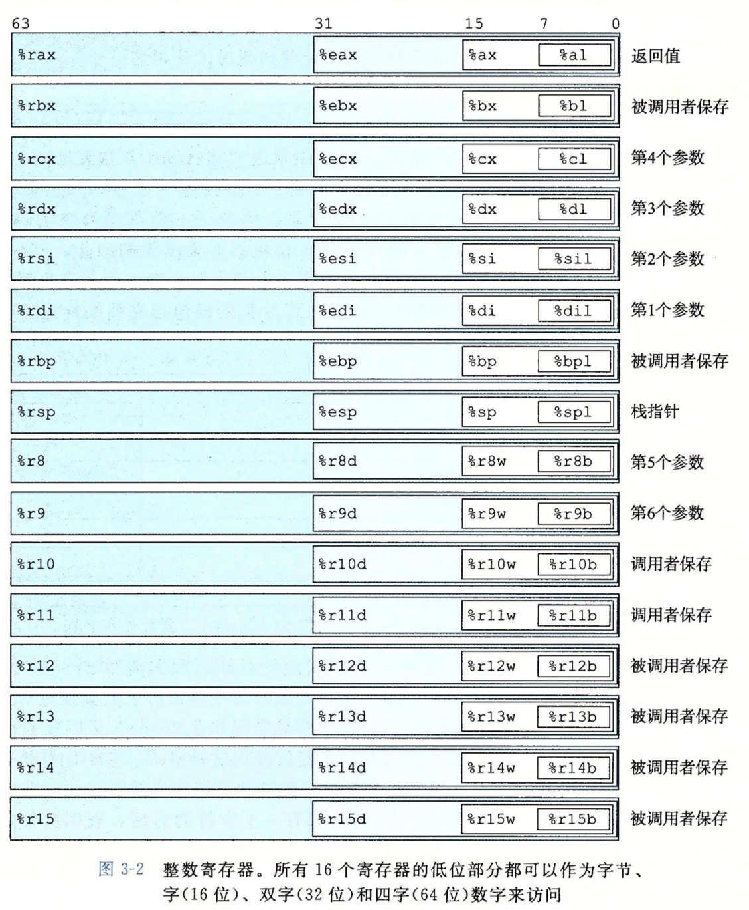
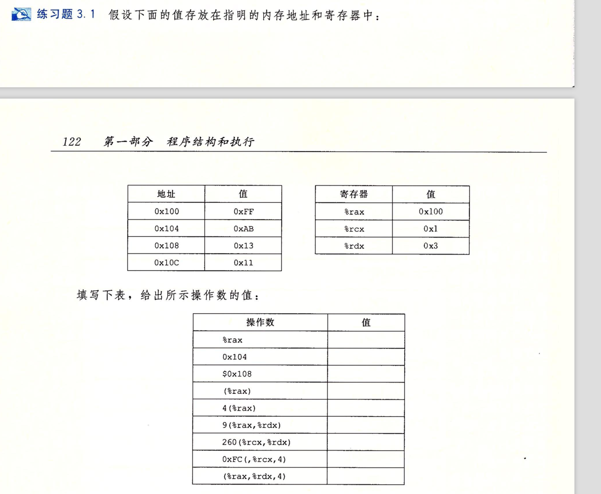
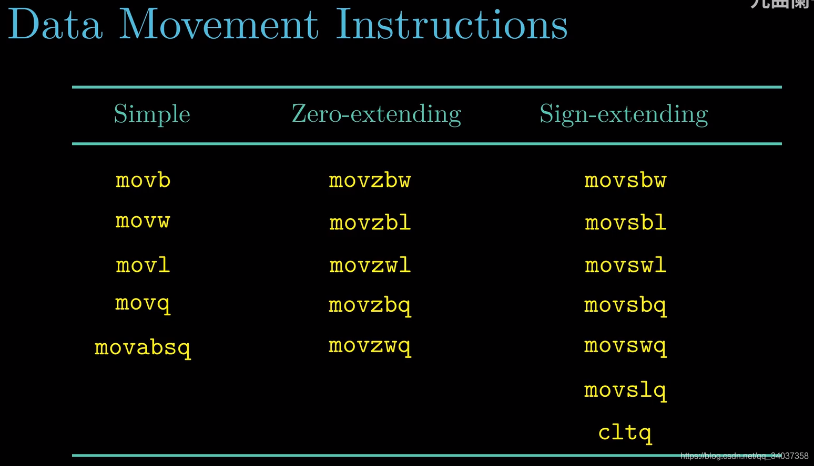
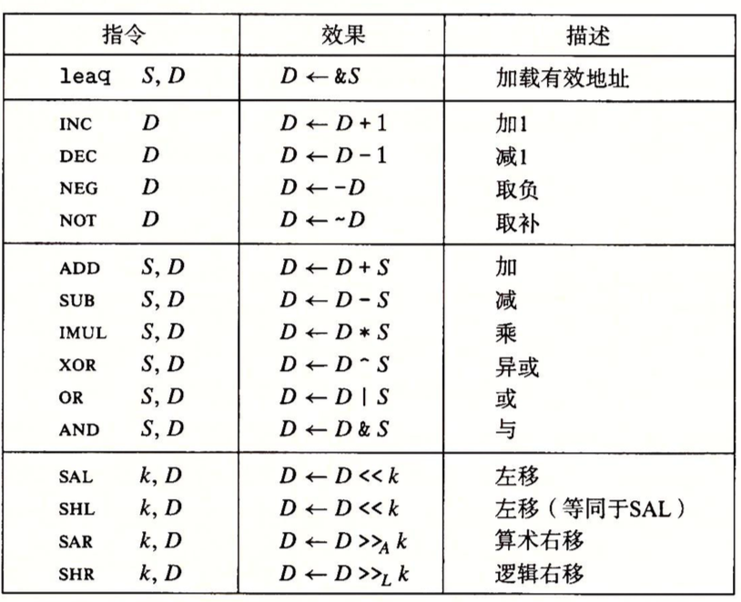
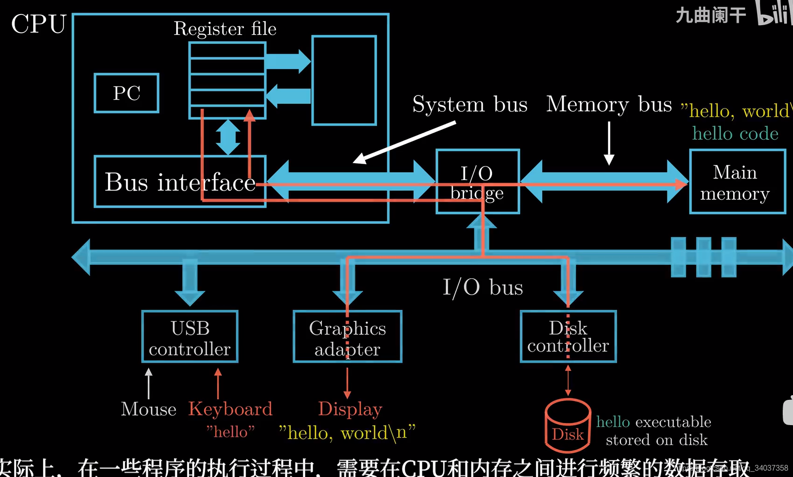
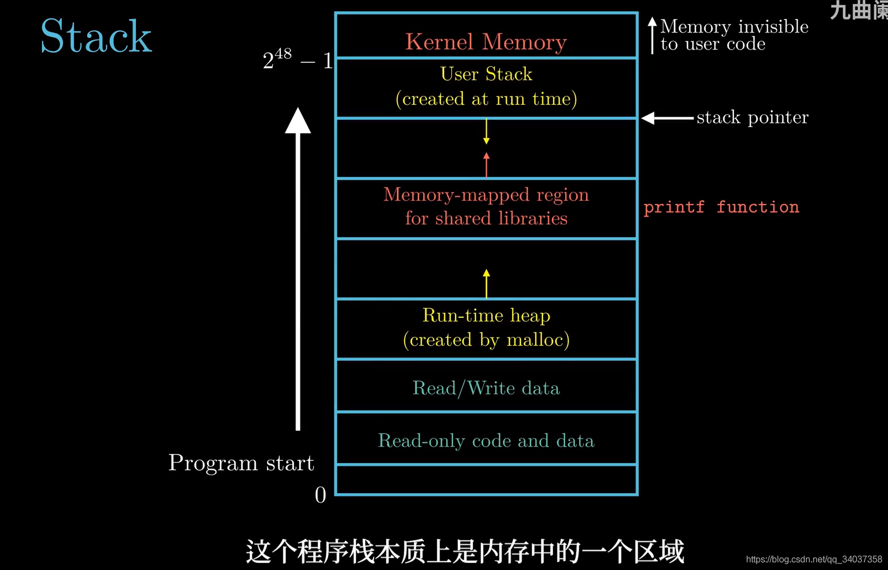
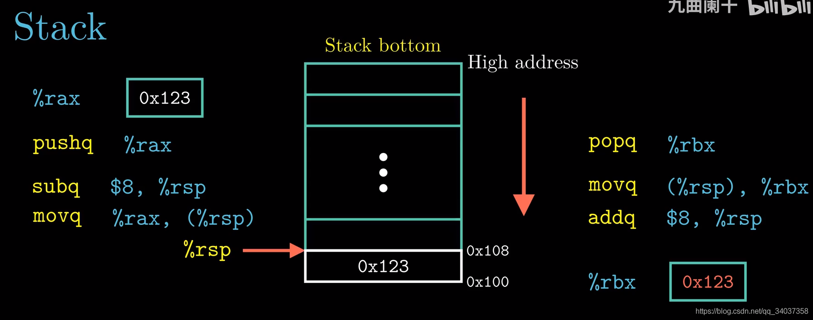

## csapp 汇编基础

## 如何由机器代码生成汇编代码？

objdump -d再加上可执行文件名即可直接在终端看到由反汇编器恢复的汇编代码

```bash
gcc -o test 01_test.c
objdump -d test
```

## 32位和64位的基本数据类型大小

## 

字节：8位，后缀：b

字：16位，后缀：w

双字：32位，后缀：l

四字：64位，后缀：q

MOV类指令也有movb,movw,movl,movq，分别对应这几种大小的操作数。



当对某个寄存器的低4字节操作时，如%eax，会自动把高4个字节全置为0。

## 寻址方式

1. $+立即数，则取得的操作数就是立即数

$0x108对应0x108

2. 立即数，则取得的操作数就是以立即数为地址，对应取出的操作数

0x104对应0xAB

3. 寄存器，则取得的操作数就是以寄存器的值

%rax对应0x100

4. (寄存器)，则取得的操作数就是以寄存器的值为地址，对应取出的操作数

(%rax)对应0xFF

4(%rax)对应0xAB

5. 立即数1(寄存器1，寄存器2，立即数2)，则取得的操作数就是以立即数1的值+寄存器1的值+寄存器2的值*立即数2为地址，对应取出的操作数

(%rax,%rdx,4)对应0x11

9(%rax,%rdx)对应0x11

260(%rcx,%rdx)对应0x13

讲解一下260(%rcx,%rdx)，因为260=0x104，所以操作数是0x104+0x1+0x3=0x108地址对应的值，是0x13

6. 有了最通用的第5条，其他变种都能写出，比如(,寄存器2，立即数2),则取得的操作数就是以寄存器2的值*立即数2为地址，对应取出的操作数

0xFC(,%rcx,4)对应0xFF



## MOV



1. movabsq,代表传送绝对的四字，movq虽可传四字，但一旦要传立即数，则只能传32位补码表示的立即数，随后把它符号拓展到64位。而movabsq可以直接传64位的立即数，但是它只能以寄存器作为目的地。

2. 所有mov指令都不支持从一个内存地址直接传到另一个内存地址，如movw (%rax),4(%rsp)是不行的。

3. 决定mov使用哪个后缀的是寄存器的大小，当两边操作的都是寄存器时，若大小不同，必须用第4条中的小数据复制到大目的地的类型的mov指令，当两边操作的是立即数和内存时，可以以立即数大小为准， 

```
movl $0x4050,%eax　　; 0x4050虽然是2字节，但%eax是4字节，所以movl

movw %bp,%sp

movb (%rdi,%rcx),%al

movb $17,(%rsp)　　; 立即数->内存

movq %rax,-12(%rbp)
```

4. 当想将小的数据复制到大的目的地时，可以用movz或movs,前者代表用0填充高字节，后者代表用符号填充高字节，后面还要加上两种转换数据的大小，

比如movzbw(字节->字，0填充)，movswq(字->四字，符号填充)

还有一种cltq指令，特指%eax->%rax的符号拓展转换，等价于movslq %eax,%rax

注意movs和movz都是以寄存器为目的地的。

根据以上信息，可以知道，之前的第3点中的特殊规则其实相当于是说movl可以实现movzlq的功能

5. 当作强制类型转换时，若既涉及大小的变化又涉及符号
变化，则操作时应先改变大小。

todo : 

例子：有两个指针，sp和dp,分别保存在%rdi和%rsi中，指向的数据类型分别是src_t和dest_t,中间寄存器为%rax,可用其任意子部分

```
; 当src_t为long,dest_t为long时，写出转换的指令：
movq (%rdi),%rax
movq %rax,(%rsi)

; 当src_t为char,dest_t为int时，写出转换的指令：

movsbl (%rdi),%eax   ; 因为char是有符号的，先用movsbl转成4字节
movl %eax,(%rsi)　　　; 以寄存器大小决定后缀用l

; 当src_t为char,dest_t为unsigned时，写出转换的指令：

movsbl (%rdi),%eax          
movl %eax,(%rsi)　;转换后两者大小相等，无需作零拓展

; 当src_t为unsigned char,dest_t为long时，写出转换的指令：
movzbq (%rdi),%rax   ;答案是movzbl (%rdi),%eax,答案疑似错了
movq %rax,(%rsi)　　　　

; 当src_t为int,dest_t为char时，写出转换的指令：

movl (%rdi),%eax  ;先改变大小指的是源比目的小时先改变大小
movb %al,(%rsi)

; 当src_t为unsigned,dest_t为unsigned char时，写出转换的指令：
movl (%rdi),%ax         
movb %al,(%rsi)　

; 当src_t为char,dest_t为short时，写出转换的指令：
movsbw (%rdi),%ax      
movw %ax,(%rsi)　
```

## 算术和逻辑操作类指令

## 算术和逻辑操作类指令分四类：加载有效地址，一元操作，二元操作和移位



## lea

todo :  fix

leaq指令，类似mov指令，它左侧的数看似是给出一个地址，内存中从给定的地址取操作数，传给右边的目的地。但其实没有取，而是直接将左侧的数对应的地址传给了右侧的目的地。
在
例子： leaq 7(%rdx,%rdx,4),%rax　　　　

若%rdx的值为x,则最后%rax的值为5x+7,而不是以5x+7为地址，在内存中寻址得到的操作数

## 算术运算

略

## stack

## 栈与数据传送指令



最初，可执行文件是保存在磁盘上，通过Shell程序，将可执行程序从硬盘加载到内存；此时程序指令以及数据都保存在内存中

CPU要执行程序，需要从内存中读取指令和数据，实际上在程序的执行过程中，需要在CPU和内存之间进行频繁的数据存取。

例如CPU执行一个加法操作C=A+B:首先CPU执行数据传送指令将A和B的值从内存读取到寄存器内，处理器完成加法运算之后，在通过一条数据传送指令将计算结果保存到内存。64位处理器中，寄存器%rax代表8个字节，%eax代表四个字节（低32位），%ax代表两个字节（低16位）；%al代表一个字节（低8位）



## push与pop指令

1. 栈是向下增长的，因此栈顶元素的地址是所有栈中元素地址中最低的。

2. %rsp保存着栈顶元素的地址。

3. push和pop同样有pushq,pushl,pushw,pushb等操作，以下都以pushq为例来讨论。

4. pushq时，先将栈顶指针减8，再将值写到新栈顶地址，如：

需要保存寄存器rax中的数据0X123，可以使用pushq指令将数据压入栈中，该指令执行的过程分为两步：

1）指向栈顶的寄存器的rsp执行减法操作

2）将需要保存的数据复制到新的栈顶地址



这两种操作的区别是机器代码中pushq指令编码占1字节，而上面两条指令加起来需要8字节。

push的本质是将数据写道内存中

pop时

1）读取栈顶位置的数据，复制到寄存器rbx

2）指向栈顶的寄存器的rsp执行加法操作

实际上pop指令是通过修改栈顶指针所指向的内存地址来实现数据删除的。

此时0X100内所保存的数据0X123仍然存在，直到下次push操作，此处保存的数据才会被覆盖。


