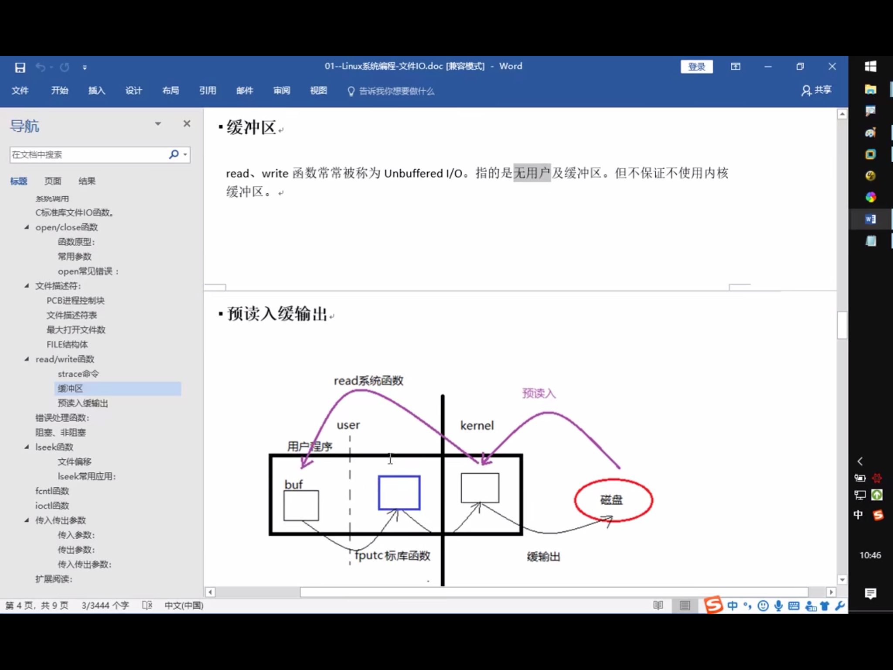
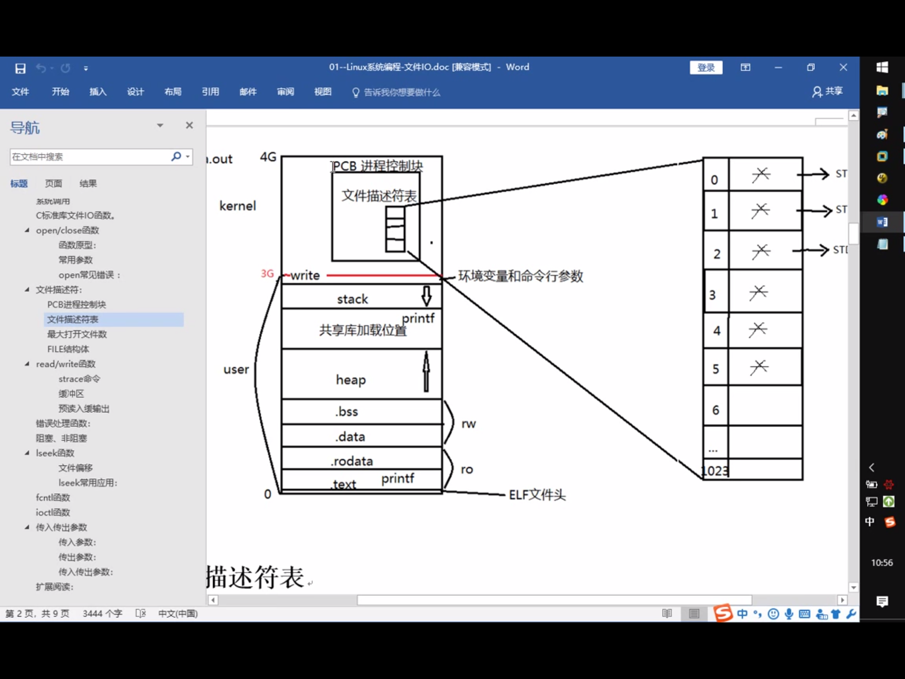

## shell

cat /etc/shells

echo $SHELL

ctrl e

ctrl u

## 

open(),close()

错误处理函数，与errno相关，strerror()

read(),write

***理解buffer

## scanf的坑

格式匹配

```c
#include <stdio.h>

int main(){
    int m, n;
    scanf("m=%d", &m);
    //getchar();
    scanf("n=%d", &n);
    printf("m=%d, n=%d\n", m, n);
    return 0;
}
```

```c
#include <stdio.h>

int main(){
    int m, n;
    printf("enter 2 nums:\n");
    scanf("%d", &m);
    scanf("%d", &n);
    printf("m = %d, n = %d\n", m, n);
    return 0;
}
```

读字符

```c
#include <stdio.h>
 
int main(){
    char a,b,c;
    int number;
    scanf("%d",&number);
    scanf("%c %c %c",&a,&b,&c);
    printf("%c,%c,%c\n",a,b,c);
    return 0;
}
```

```c
#include <stdio.h>
 
int main(){
    char a,b,c;
    int number;
    scanf("%d",&number);
    getchar();
    scanf("%c %c %c",&a,&b,&c);
    printf("%c,%c,%c\n",a,b,c);
    return 0;
}
```

格式串结尾空白符引发的血案

Problem:

```c
#include <stdio.h> 
int main()
{
    int a[5];
    int i;
    
    for (i = 0; i < 5; i++)
        scanf("%d\n", &a[i]);
    
    for (i = 0; i < 5; i++)
        printf("%d ", a[i]);
    
    return 0;
}
// 1
// 2
// 3
// 4
// 5
// 6
// 1 2 3 4 5
```

注意到 scanf() 读入数据时会跳过必要的空白符（如空格、换行、制表符等），准确来说是在读取非字符型数据时才跳过

在输入了第一个数后，可以先随便乱敲任意个空格、回车或换行键后再输入第二个数，程序照样正常运行，即使格式字符串中的 %d%d 是紧挨着的


需要注意scanf()函数的使用，主要有以下几点：

1）%d以空格，换行，Tab结束输入。

2）%c可以接受单个字符（包括空格，换行。也就是说空格与换行在计算机中作为ASCII码的存在，是被当做字符可以接收的

3)x=%d,一定要输入匹配

4）注意如何使用getchar()去解决问题

原来 scanf() 格式串中的空白符并不表示匹配此字符，而是重新读取一个非空白字符。scanf("%d\n%d", &i, &j); 或者 scanf("%d %d", &i, &j); 这种写法中空白符位于两个数据转换符之间，所以体现不出这个奇葩特性（空白符后本来就要读取一个非空白的 %d 数据）。但是如果空白符位于格式串的末尾，问题就来了 —— 在按指定方式读取后要求多读一个非空白字符

```c
#include <stdio.h> 
int main()
{
    int i;
    
    scanf("%d\n", &i);
    
    printf("i = %d\n", i);
    
    return 0;
}
// 520
// 1314
// i = 520
```

在输入第一个数据 520 后，格式串遇到了空白符 \n，此时scanf() 仍然处于等待状态，继续读取下一个非空白符后才会结束。

死循环问题

- scanf的坑
除"空格","回车","tab"之外, 如果输入的数据和scanf接收的数据不匹配将会自动结束接收。

如果在输入时,输入了多个空格、回车、Tab都会被系统忽略的。

如果要获取的内容是多个整数,中间输入了多个空格、回车、Tab都会被系统忽略。

如果要获取的内容是多个实型,中间输入了多个空格、回车、Tab都会被系统忽略。

当整形的数和字符混合输入时,要避免“空格” 添麻烦。

为防止混合输入空格造成的错误,可以通过添加普通的分隔符解决。如","。

scanf函数当遇到回车的时候，会结束执行。

所以在scanf中，尽量不要使用 \n。如果在scanf中使用了\n, 需要原样输入"\n"。


## reference

《你必须知道的495个C语言问题》

[link1](http://www.shaoguoji.cn/2017/05/23/weird-scanf/)

[link2](https://www.zfl9.com/c-buffer.html)

[link3](https://blog.csdn.net/liu16659/article/details/70305949)

## 

**所有的系统函数都应该检查返回值**

perror


## 输入和输出

printf() and scanf()

getchar() & putchar() 

gets() & puts()

## 文件读写

fopen() and fclose()

fputc() and fputs()

fprintf() and fscanf

二进制 I/O 函数 fread() and fwrite()

strace(mac下为dtruss) ，跟踪程序

了解为什么fread/fwrite为什么要比系统调用read和write快(buf同设为1)



优先使用库函数

