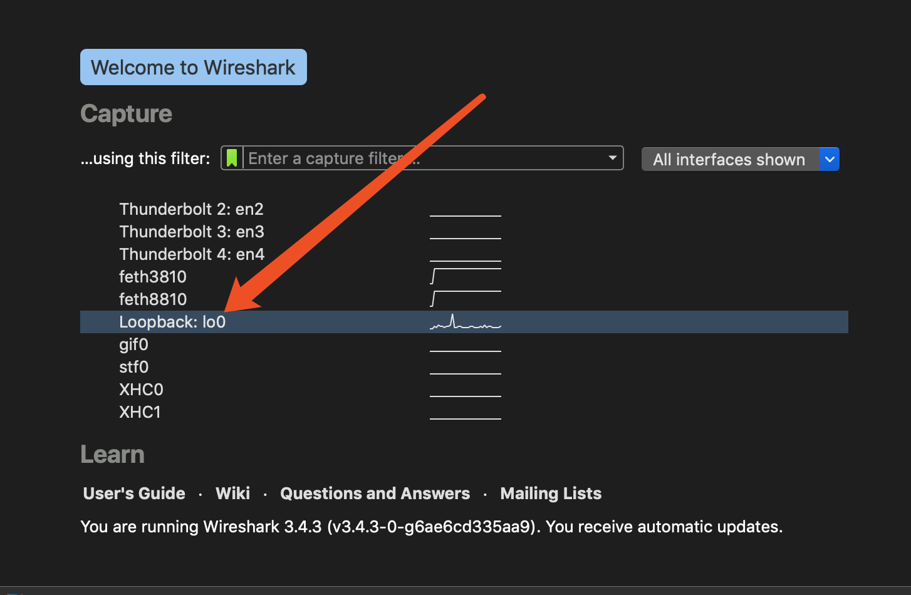

## 实验环境搭建

## 软件

wireshark 

telnet ：基于tcp协议远程登陆主机

chrome

openrestry


## openrestry

安装 for mac:

```bash
brew install openresty/brew/openresty 

cd http_study/www/
./run.sh start
./run.sh list 
./run.sh reload
./run.sh stop
```

openrestry 最佳实践 : 

https://moonbingbing.gitbooks.io/openresty-best-practices/content/

## 什么是host文件

其基本作用就是将一些常用的网址域名与其对应的 IP 地址建立一个关联“ 数据库 ”。当用户在浏览器中输入一个需要登录的网址时，系统会首先自动从hosts文件中寻找对应的 IP 地址，一旦找到，系统就会立即打开对应网页，如果没有找到，则系统会将网址提交 DNS 域名解析服务器进行 IP 地址的解析

- 加快域名解析

- 构建映射关系

- 屏蔽垃圾网站

https://blog.csdn.net/qq_35246620/article/details/66970211

## 测试环境

```bash
cd http_study/www/
./run.sh start
```



然后filter选择“HTTP TCP port(80)", 只抓取http相关数据包，loopback 在本地

浏览器输入http://localhost/

然后403 forbidden,原因还是没有html/index.html访问权限

解决: 

ls -al html 得到user和group

我的是frank和staff

然后在conf/nginx.conf文件顶部添加

user frank staff;

再次启动openrestry

然后查看到wireshark已经抓取

注意记住stop服务器

## 

linux上可以curl发送测试命令，tcpdump抓包


