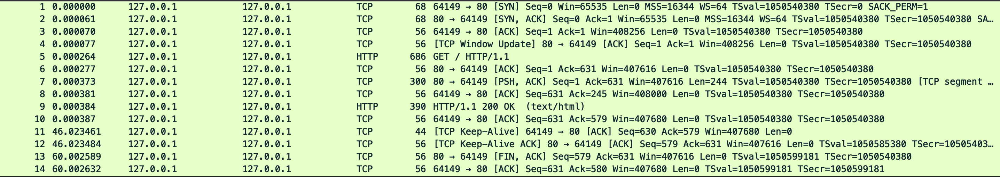

## 

## 使用IP访问web服务器

1. wireshark : lo + HTTP TCP port(80)

2. chrome 输入 http://127.0.0.1/ 

## 抓包分析

注意开无痕浏览器

首先建立TCP连接(三次握手， 服务器默认80，浏览器54281)

最开始经过 1. SYN  2. SYN/ACK  3. ACK三个包 建立连接

（无痕这里会有多个tcp连接 ： 因为http 1连接传输效率低，一般多个连接提升效率）

浏览器 通过tcp 发送 (4) GET / HTTP/1.1 请求报文

服务器1 (5) ack返回在TCP协议层确认表示收到，这个tcp包http协议看不到

服务器收到报文在内部处理请求，解析报文，看浏览器发送想要干啥

获取 / 根目录下默认文件，从磁盘把文件全读出来，拼成符合HTTP格式的报文发回去，就是(6)HTTP/1.1 200 OK 

浏览器回一个(7)ack，浏览器也需要解析报文，然后渲染输出页面

注意: 这里没有出现四次挥手，因为HTTP/1.1 长连
接，默认不会立刻关闭连接

## 使用域名访问web服务器

- 输入域名

- 域名解析

多级缓存 : 

浏览器缓存

操作系统缓存 hosts

然后才是去dns服务器查询

还可以从CDN中拿(CDN缓存网站的大部分资源)

由php，java等后台服务器生成的页面属于动态资源，CDN无法缓存，只能从目标网站中获取。

目标网站，入口负载均衡设备 --> 访问缓存服务器 --> 没有就给应用服务器(后台) --> 数据库服务