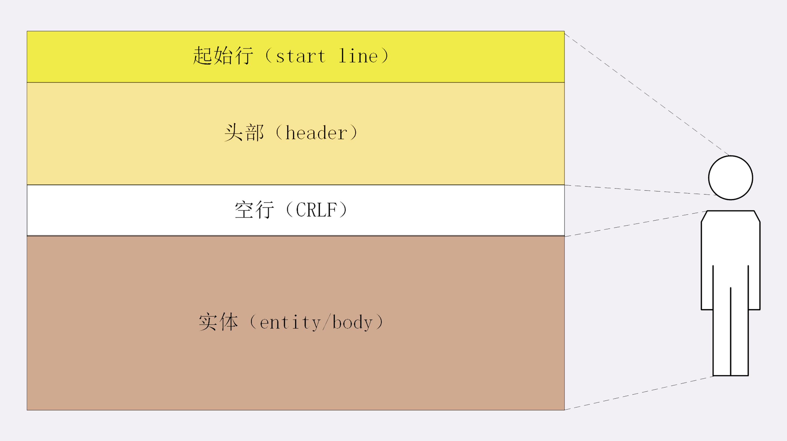

## HTTP报文结构

HTTP 与 TCP/UDP不同，是纯文本的协议，头数据是ASCII码的文本，可以直接肉眼看

## 组成



1. 起始行 

请求或响应基本信息

- 请求行 request line 

简要描述了客户端想要如何操作服务器的资源

1)请求方法 GET/POST

2)请求目标 URI

3)版本号 

```
GET / HTTP/1.1
```
- 状态行 (status line 而不是响应行)

1)版本号

2)状态码，常见200，404，403，500

3)原因 ， 作为数字码的补充

```
HTTP/1.1 200 OK
```

2. 头部字段集合

key value 更详细说明报文

hint: 不区分大小写，字段名不允许空格和_,:前不能有空格，后可以有多个，字段顺序无意义，原则上不重复

1，2 经常合成 **请求头** **响应头** 

3. 消息正文 

不一定纯文本，可以图片视频等二进制

一定有header，不一定有body

## curl I 查看HTTP 响应头信息

```
curl -I "http://www.taobao.com"
HTTP/1.1 301 Moved Permanently
Server: Tengine
Date: Fri, 26 Mar 2021 11:45:00 GMT
Content-Type: text/html
Content-Length: 278
Connection: keep-alive
Location: https://www.taobao.com/
Via: cache17.cn1439[,0]
Timing-Allow-Origin: *
EagleId: 71cf212516167591000522559e

```

## 常用头字段

1. 通用字段

2. 请求字段

3. 响应字段

4. 实体字段

host字段，请求字段，必须出现(否则发给谁)

User-Agent ,请求

Date : 通用

Server : 响应

Content-Length : 实体，没有就是不定长，需要chuncked方式分段传输

