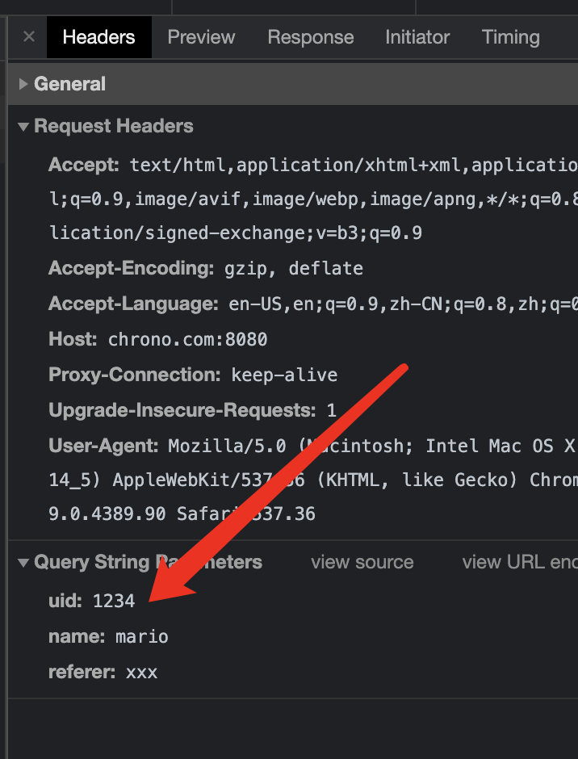

## URI格式

[scheme] [://] [host:port] [path] [?query]

端口号有时可以省略，通过scheme使用默认端口号

浏览器输入www.chrono.com/11-1

## URI的查询参数 qurey

http://chrono.com:8080/11-1?uid=1234&name=mario&referer=xxx

query如果太长，可以用get方法放在body里发送给服务器

## URI完整格式

[sceme][://][user:passwd@][host:port][path][?query][#fragment]

user:passwd@ 存在安全隐患，RFC7230不推荐

#fragment 是URI所定位资源的"锚点"，"标签",浏览器可以在获取资源后直接跳转到指示的位置，仅能由浏览器这种客户端使用，服务器看不到

## URI 的编码

URI是ASCII码

粗暴 转义。 非ASCII转为十六进制，在前面加上%

