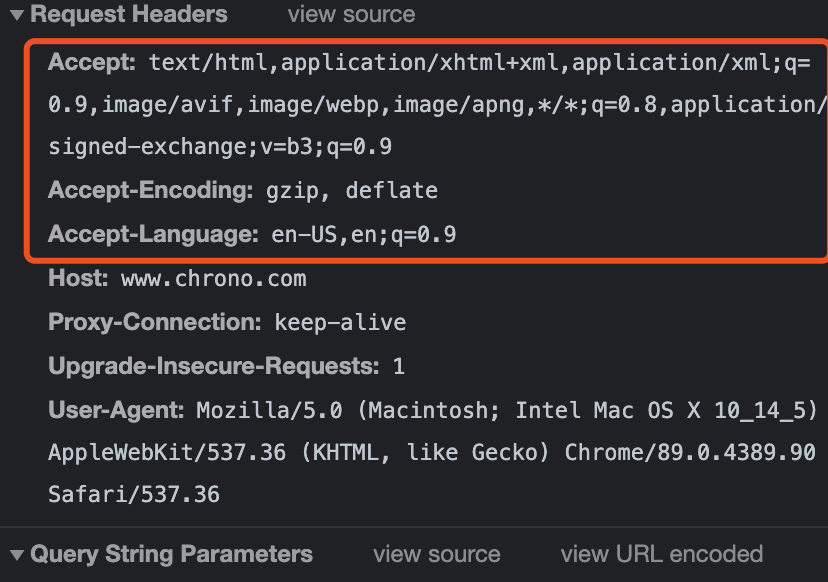

## HTTP 实体

## MIME -- 标记body数据类型 

数据到达后，需要告诉上层应用这是什么数据

相关头字段 Accept, Content-Type

## type/subtype 形式

压缩方式的头字段 Accept-Encoding, Content-Encoding

## 语言类型和编码

语言类型 是 自然语言

头字段 Accept-Language, Content-Language

字符集 编码方式 

头字段 Accept-Charset, Content-Type

## 内容协商的质量值

q 表示权重来设定优先级 (quality factor)

最大1， 最小0.01， 默认1， 0 表示拒绝

HTTP中 ; 意义小于 ,

```
Accept: text/html, application/xml;q=0.9, */*; q=0.8
```

最希望html文件，权重是1，其次XML文件，权重0.9，最后是任意类型数据，权重0.8

## 内容协商的结果

请求头用Accept和服务器进行内容协商，要求返回最合适的数据

内容协商过程不透明，每个Web服务器算法不一样

有时候会加一个Vary字段，记录服务器在内容协商时参考的请求头字段

```
Vary: Accept-Encoding, User-Agent, Accept
```

每当Accept等请求头变化，Vary也会随着相应报文一起变化，同一个URI可能会有多个不同的版本，主要用在传输链路中间的代理服务器实现缓存服务

## 观察实验

```
http://www.chrono.com/15-1?name=a.json

http://www.chrono.com/15-1?name=a.xml
```



