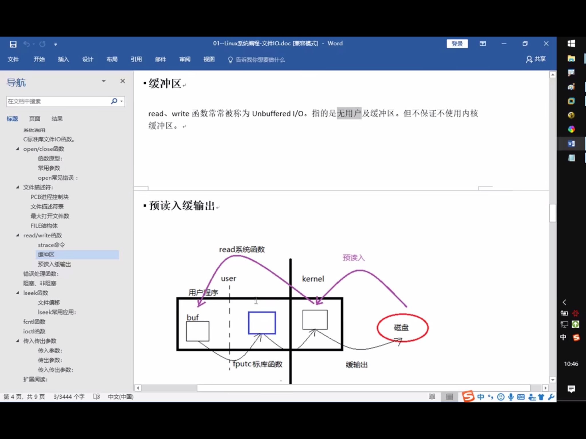
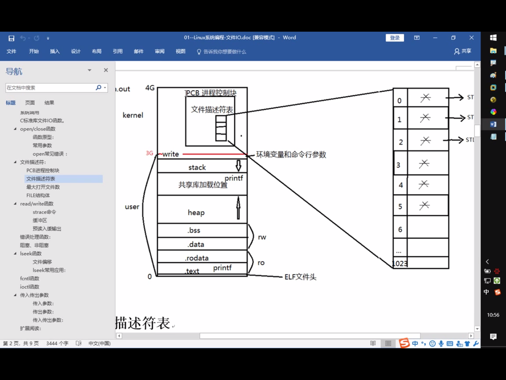
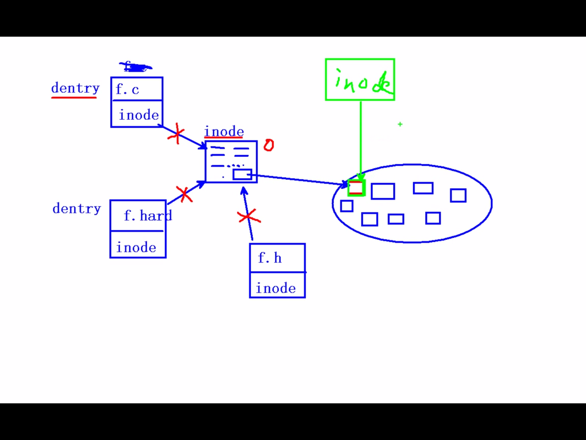
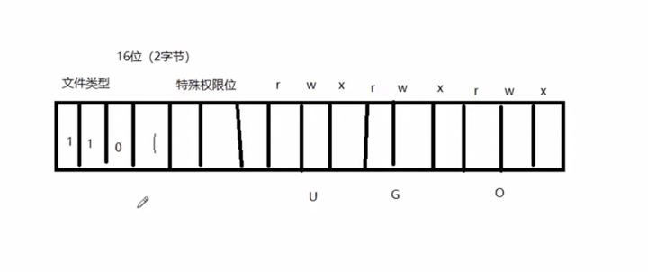
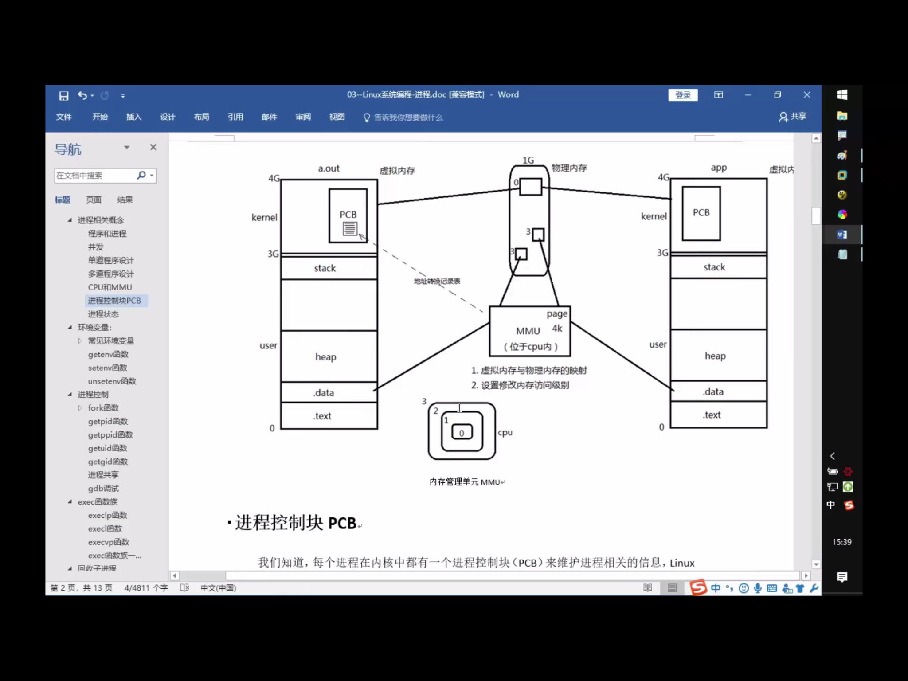
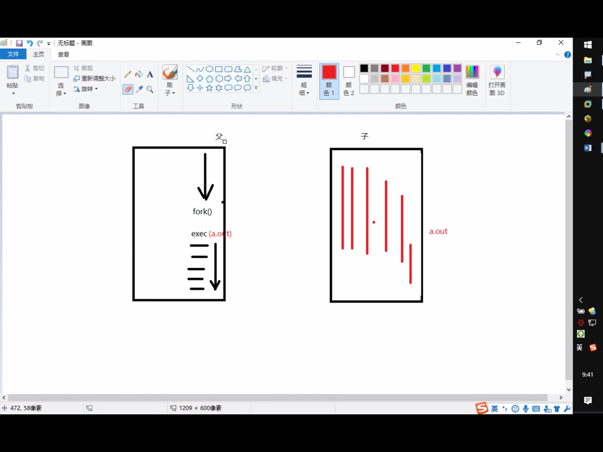
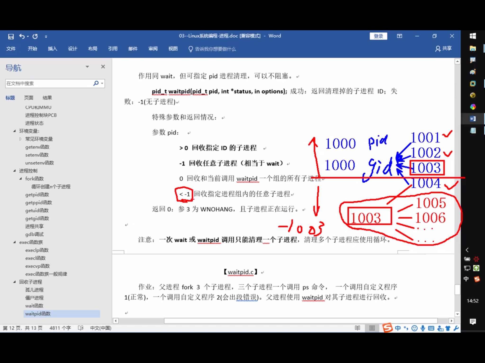
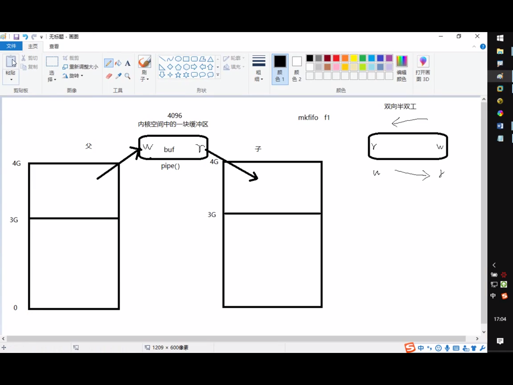

## shell

cat /etc/shells

echo $SHELL

ctrl e

ctrl u

## 

open(),close()

错误处理函数，与errno相关，strerror()

read(),write

***理解buffer

## scanf的坑

格式匹配

```c
#include <stdio.h>

int main(){
    int m, n;
    scanf("m=%d", &m);
    //getchar();
    scanf("n=%d", &n);
    printf("m=%d, n=%d\n", m, n);
    return 0;
}
```

```c
#include <stdio.h>

int main(){
    int m, n;
    printf("enter 2 nums:\n");
    scanf("%d", &m);
    scanf("%d", &n);
    printf("m = %d, n = %d\n", m, n);
    return 0;
}
```

读字符

```c
#include <stdio.h>
 
int main(){
    char a,b,c;
    int number;
    scanf("%d",&number);
    scanf("%c %c %c",&a,&b,&c);
    printf("%c,%c,%c\n",a,b,c);
    return 0;
}
```

```c
#include <stdio.h>
 
int main(){
    char a,b,c;
    int number;
    scanf("%d",&number);
    getchar();
    scanf("%c %c %c",&a,&b,&c);
    printf("%c,%c,%c\n",a,b,c);
    return 0;
}
```

格式串结尾空白符引发的血案

Problem:

```c
#include <stdio.h> 
int main()
{
    int a[5];
    int i;
    
    for (i = 0; i < 5; i++)
        scanf("%d\n", &a[i]);
    
    for (i = 0; i < 5; i++)
        printf("%d ", a[i]);
    
    return 0;
}
// 1
// 2
// 3
// 4
// 5
// 6
// 1 2 3 4 5
```

注意到 scanf() 读入数据时会跳过必要的空白符（如空格、换行、制表符等），准确来说是在读取非字符型数据时才跳过

在输入了第一个数后，可以先随便乱敲任意个空格、回车或换行键后再输入第二个数，程序照样正常运行，即使格式字符串中的 %d%d 是紧挨着的


需要注意scanf()函数的使用，主要有以下几点：

1）%d以空格，换行，Tab结束输入。

2）%c可以接受单个字符（包括空格，换行。也就是说空格与换行在计算机中作为ASCII码的存在，是被当做字符可以接收的

3)x=%d,一定要输入匹配

4）注意如何使用getchar()去解决问题

原来 scanf() 格式串中的空白符并不表示匹配此字符，而是重新读取一个非空白字符。scanf("%d\n%d", &i, &j); 或者 scanf("%d %d", &i, &j); 这种写法中空白符位于两个数据转换符之间，所以体现不出这个奇葩特性（空白符后本来就要读取一个非空白的 %d 数据）。但是如果空白符位于格式串的末尾，问题就来了 —— 在按指定方式读取后要求多读一个非空白字符

```c
#include <stdio.h> 
int main()
{
    int i;
    
    scanf("%d\n", &i);
    
    printf("i = %d\n", i);
    
    return 0;
}
// 520
// 1314
// i = 520
```

在输入第一个数据 520 后，格式串遇到了空白符 \n，此时scanf() 仍然处于等待状态，继续读取下一个非空白符后才会结束。

死循环问题

- scanf的坑
除"空格","回车","tab"之外, 如果输入的数据和scanf接收的数据不匹配将会自动结束接收。

如果在输入时,输入了多个空格、回车、Tab都会被系统忽略的。

如果要获取的内容是多个整数,中间输入了多个空格、回车、Tab都会被系统忽略。

如果要获取的内容是多个实型,中间输入了多个空格、回车、Tab都会被系统忽略。

当整形的数和字符混合输入时,要避免“空格” 添麻烦。

为防止混合输入空格造成的错误,可以通过添加普通的分隔符解决。如","。

scanf函数当遇到回车的时候，会结束执行。

所以在scanf中，尽量不要使用 \n。如果在scanf中使用了\n, 需要原样输入"\n"。


## reference

《你必须知道的495个C语言问题》

[link1](http://www.shaoguoji.cn/2017/05/23/weird-scanf/)

[link2](https://www.zfl9.com/c-buffer.html)

[link3](https://blog.csdn.net/liu16659/article/details/70305949)

## 

**所有的系统函数都应该检查返回值**

perror


## 输入和输出

printf() and scanf()

getchar() & putchar() 

gets() & puts()

## 文件读写

fopen() and fclose()

fputc() and fputs()

fprintf() and fscanf

二进制 I/O 函数 fread() and fwrite()

strace(mac下为dtruss) ，跟踪程序

了解为什么fread/fwrite为什么要比系统调用read和write快(buf同设为1)



优先使用库函数



## 阻塞 and 非阻塞

## lseek，truncate

## 参数

传入参数：

1. 指针作为函数参数

2. 通常有const 关键字修饰

3. 指针指向有效区域，在函数内部做读操作

传出参数

1. 指针作为函数参数

2. 在函数调用之前，指针指向的空间可以无意义，但必须有效。

3. 在函数内部，做写操作，

4. 函数调用结束后，充当函数返回值

传入传出参数

1. 指针作为函数参数

2. 在函数调用之前，指针指向的空间要有实际意义

3. 在函数内部，先做读操作，后做写操作

4. 函数调用结束后，充当函数返回值

## 文件系统

inode / dentry

stat xx



## stat and lstat 

穿透符号链接: stat : 会 lstat: 不会

ln -s f f.soft



S_IFMT 

st_size

st_mode 

## link and unlink

硬链接：

操作系统给每一个文件赋予唯一一个inode，当有相同的inode文件存在时，彼此同步

Inode相同

ln 1.c 1.hard 

删除时，只将硬链接计数减一，减为0时，inode被释放

软连接： 相当于win下的快捷方式

要想软连接移动到任何地方都能访问，那要写上1.c的绝对路径

他的大小为路径大小

软连接本身的权限全开放

ln -s 1.c 1.soft

unlink: remove directory entry

## opendir()/closedir()

ulimit -a 

## 实现递归遍历目录 ls -R

## dup / dup2

重定向

cat ls.c > out

cat ls.c >> out 追加

dup 文件描述符复制

dup2 文件描述符复制，重定向

## fcntl实现dup

参3：传入被占用的，返回最小可用的

    未被占用的，返回该值的文件描述符

# 进程

- 区分进程和程序

程序:只占用磁盘空间

进程:运行起来的程序，占用内存，cpu等系统资源

MMU : 虚拟内存映射单元




## pcb

/usr/src/linux-headers-5.0.0-29/include/linux/sched.h

struct task_struct

PCB进程控制块：

进程ID

文件描述符表

进程状态：初始，就绪，运行，挂起，终止

进程工作目录位置

umask

信号相关信息资源

用户ID和组id

## 环境变量

LD_LIBRARY_PATH 动态链接器

PATH 可执行文件路径

//echo $PATH

SHELL 

//echo $SHELL

TERM

LANG

HOME

env 查看所有的环境变量

# 进程控制

## fork***

创建子进程

父子进程格子返回，父进程返回子进程pid,子进程返回0

## getpid() / getppid();


## 循环共享

循环创建n个子进程

## 进程共享

父子进程之间在fork后，有哪些相同，哪些不同的地方？

- 相同：

刚fork后。data段，text段(代码段)，堆，栈，环境变量，全局变量，宿主目录位置，进程工作目录位置，信号处理方式

- 不同

进程id，返回值，各自的父进程，进程创建的时间，闹钟，未决信号集

## 

父子进程遵循读时共享写时复制    ------全局变量

父子进程共享：

1. 文件描述符(打开文件的结构体)

2. mmap建立的映射区(进程间通信详解)


特别的，fork之后父进程先执行还是子进程先执行不确定。取决于内核所使用的调度算法

## GDB专题(待)

## exec函数族

就是使进程执行某一程序，成功无返回值，失败返回-1

execlp 借助PATH环境变量寻找执行程序

execl 自己指定执行程序路径

execvp ...



将当前进程的.text,.data替换为所要加载的程序的.text,.data，然后让进程从新的.text第一条指令开始执行，但进程ID不变，换核不换壳

## 回收子进程

## 孤儿进程

孤儿进程：父进程先于子进程结束，则子进程成为孤儿进程，子进程的父进程成为init进程，称为init进程领养孤儿进程

ps aux

ps ajx

## 僵尸进程

进程终止，父进程尚未回收，子进程残留资源(PCB)存放在内核中，变成僵尸进程

特别注意，不能用kill清楚，kill命令只能用来终止进程，而僵尸进程以及停止。

Thinking:如何可清除僵尸进程？

杀死他的父亲

## wait()

pid_t wait(int* status)

参数： (传出)回收进程的状态

返回值

成功： 回收进程的pid

失败 : -1  errno

获取子进程正常终止值:

WIFEXITED(status) --> 为真 --> 调用WEXUTSTATUS(status) --> 得到子进程退出值

获取导致子进程异常终止信号:

WIFSIGNALED(status) --> 为真 --> 调用WTERMSIG(status) --> 得到导致子进程异常终止的信号编号

父进程调用wait函数可以回收子进程终止信息。改函数有三个功能

1. 阻塞等待子进程退出

2. 清理子进程残留在内核的PCB资源

3. 通过传出参数，获取子进程结束状态(退出原因)

kill -l 查看kill的信号

## waitpid()

可指定某一进程进行回收

pid_t waitpid(pid_t pid, int *status, int options)

args:

pid：指定回收的子进程pid

> 0 回收指定ID的子进程

-1 回收任意子进程（相当于wait)

0 回收和当前调用waitpid一个组的所有子进程

< -1 回收指定进程组内的任意子进程


status （传出）回收进程的状态

options WNOHANG 指定回收方式为非阻塞

return value:

    > 0 : 表示成功回收的子进程pid

    0 : 函数调用时,第三个参数指定WNOHANG,并且没有子进程结束

    -1 : fail, errno



总结：wait，waitpid 一次调用，回收一个子进程

想回收多个，while

waitpid(-1, &status, 0) == wait(&status)

## 进程之间通信

InterProcess Communication




