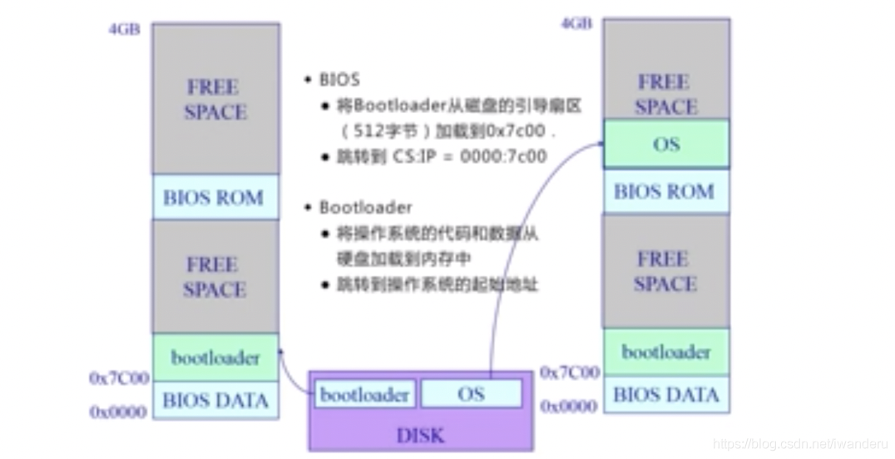

## os 启动

CPU, I/O, 内存通过总线连接。

1） 

DISK: 存放OS

BIOS：基本I/O处理系统( basic I/O system);

一按电源，BIOS检测各种外设，加载相应的软件执行

2）

Bootloader: 加载OS从磁盘到内存中，让我们的CPU能够执行操作系统

一般放在第一个磁盘的第一个主引导扇区(512个字节)

3）

当电脑通电时，段寄存器CS和指令寄存器IP能够确定一个内存地址，从这里执行bios，例如CS:IP = 0xf000:fff0.

4)

POST(加电自检)，寻找显卡和执行BIOS。(显示器，键盘…是否正常)。

## 操作系统和设备/程序的交互

1) 

系统调用：(来源于应用程序)应用程序主动向操作系统发出服务请求。

异常：(来源于不良的应用程序)非法指令或其它坏的处理状态(e.g.内存出错)

中断：(来源于外设)来自不同的硬件设备的计时器和网络的中断

2) 

为什么应用程序不能直接访问硬件而是通过操作系统？

- 计算机运行时，内核是被信任的第三方。
- 只有内核可以执行特权指令。
- 为了方便应用程序。

3)

产生的源头

- 中断：外设(键盘/鼠标/网卡/声卡/显卡，可以产生各种事件)
- 异常：应用程序意想不到的行为(e.g.除0操作，恶意程序，应用程序需要的资源未得到满足)
- 系统调用(system call)：应用程序请求操作提供服务(e.g.打开/关闭/读写文件，发送网络包)

4)

处理时间

- 中断：异步；
- 异常：同步；
- 系统调用：同步或异步。

5)

响应

- 中断：持续，对用户应用程序时透明的
- 异常：杀死或者重新执行意想不到的应用程序指令
- 系统调用：等待和持续

6)

中断/异常处理机制

- 中断是外设的事件，
- 异常是CPU的事件；
- 中断/异常迫使CPU访问一些被中断和异常服务访问的功能。

## 中断处理机制

大致流程：

收到中断，查找中断表，然后查到相应的中断服务例程的起始地址，打断当前执行，跳转到中断服务执行

因为要打断，所以要对软件硬件做出相应保护

- 硬件：

将内部/外部事件设置中断标记；

中断事件的ID(程序访问的中断向量地址)

- 软件(操作系统)：

保存当前处理状态

中断服务程序处理

清除中断标记

恢复之前保存的处理状态

## 异常处理机制

异常：异常编号

- 保存现场
- 异常处理：

    杀死产生异常的程序；
    
    重新执行异常指令
- 恢复现场

## 系统调用
 
详见HIT如何写一个系统调用

## 用户态/内核态

- 用户态：应用程序在执行的过程中，CPU执行的特权级的状态(很低，不能访问特殊机器指令和IO)。
- 内核态：应用程序在执行的过程中，CPU执行的特权级的状态(高，操作系统可以执行CPU任何一条指令)。
- 系统调用时涉及到特权级从用户态到内核态的转换，应用程序和操作系统有各自的堆栈，这两个变化比函数调用的开销更大，但更安全和可靠。(而程序调用是在一个栈空间实现参数的调用和返回)。

特权级转换和堆栈切换都有一定开销

- 总结 : 跨越操作系统边界的开销

1. 建立中断/异常/系统调用号与对应服务例程映射关系的初始化开销；
2. 建立内核堆栈(操作系统和应用程序的堆栈不一样)；
3. 验证参数(操作系统会检查数据)；
4. 内核态映射到用户态的地址空间，更新页面映射权限(内存拷贝开销)；
5. 内核态独立地址空间TLB 刷新过程。

