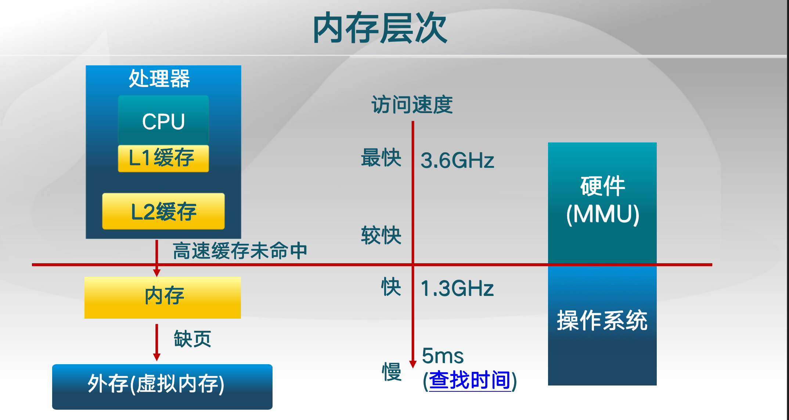
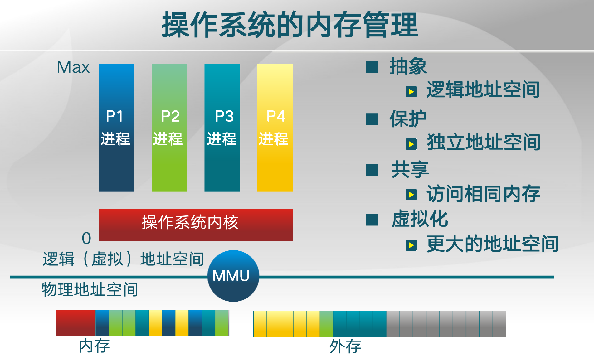
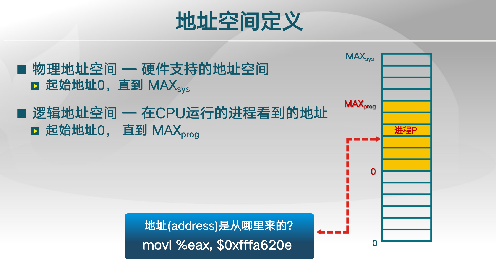
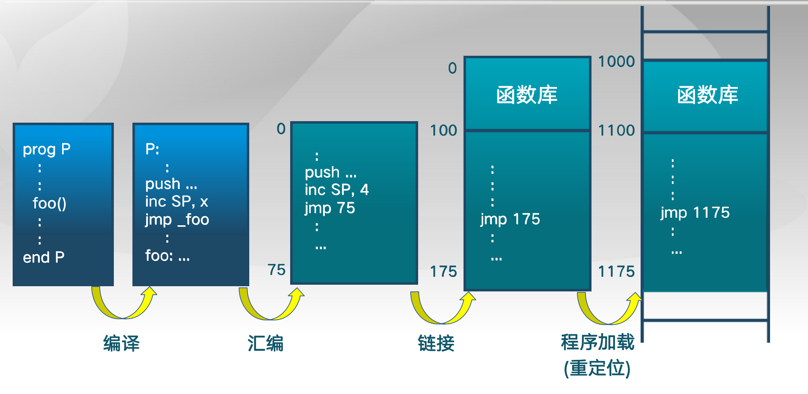
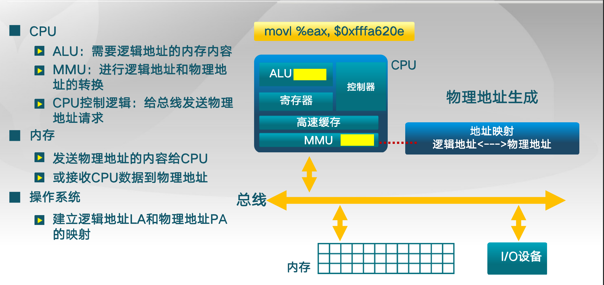
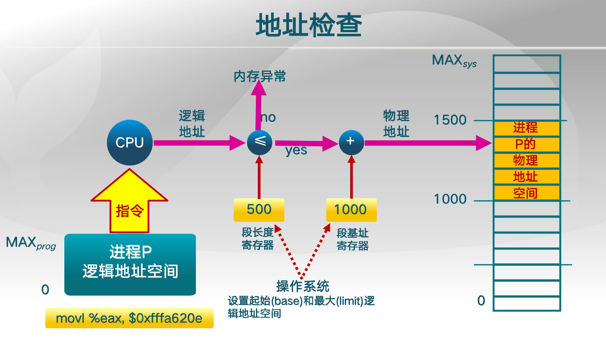

## 计算机体系结构

CPU，内存，I/O

内存层次结构

## 操作系统在内存管理要完成的目标

操作系统实现内存管理目标的方法

- 程序重定位
- 分段
- 分页
- 虚拟内存
- 按需分页虚拟内存

实现高度依赖硬件

- 内存架构

- MMU（内存管理单元): 硬件组件负责处理CPU的内存访问请求

## 地址空间

逻辑地址空间 - 一维线性空间

要建立对应关系，逻辑地址空间都要落实到物理地址空间

## 地址空间的生成

c程序函数的名字就是一个地址 foo()

jmp _foo

通过应用程序，编译器，汇编器，linker，loader生成逻辑地址

注意这里LA和PA之间的映射由OS提前建立好映射

最重要的是起始地址和长度

保证进程与进程之间不被破坏(独立)

