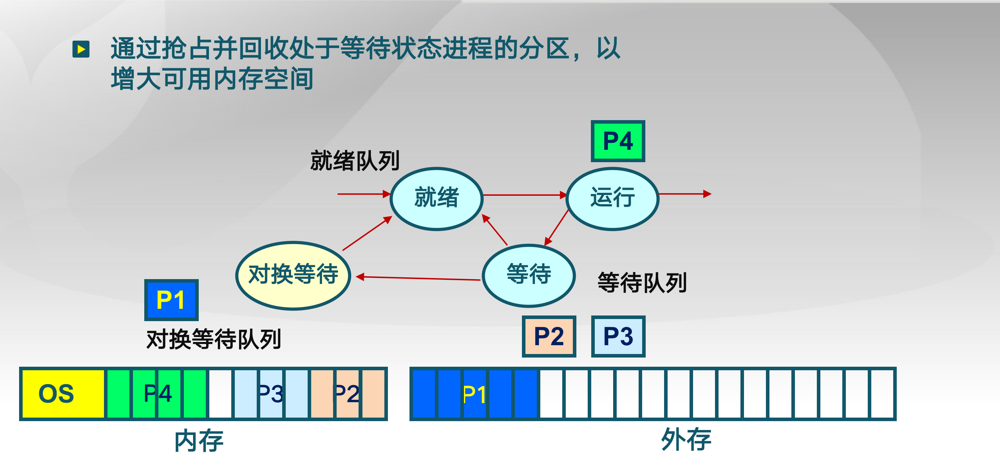

## 连续内存的碎片问题

- 空闲内存不能被利用

1. 外部碎片

2. 内部碎片

## 简单的内存管理方法：

## 分区的动态分配策略

1) 首次适配

2) 最佳适配

3) 最差匹配

## 减小碎片方法

1）紧凑(compaction)

什么时候移动？

程序在运行时不能挪动

开销: 频繁挪动 - 拷贝开销很大 

2） 分区对换(Swapping in/out)

将磁盘利用起来了，把硬盘当做一个备份

把暂时不需要执行的先拷贝到磁盘备份，先去执行其他的

问题: 1.换出换入哪个程序 ？ 2. 什么时候执行 3. 换大程序开销大怎么办

