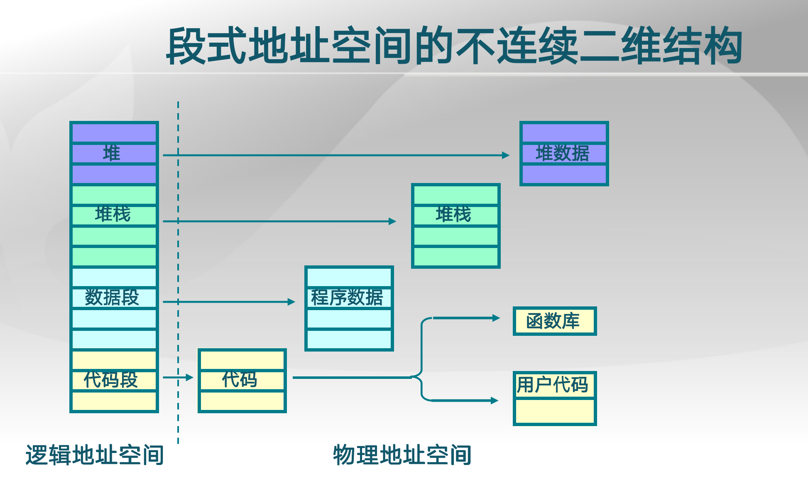
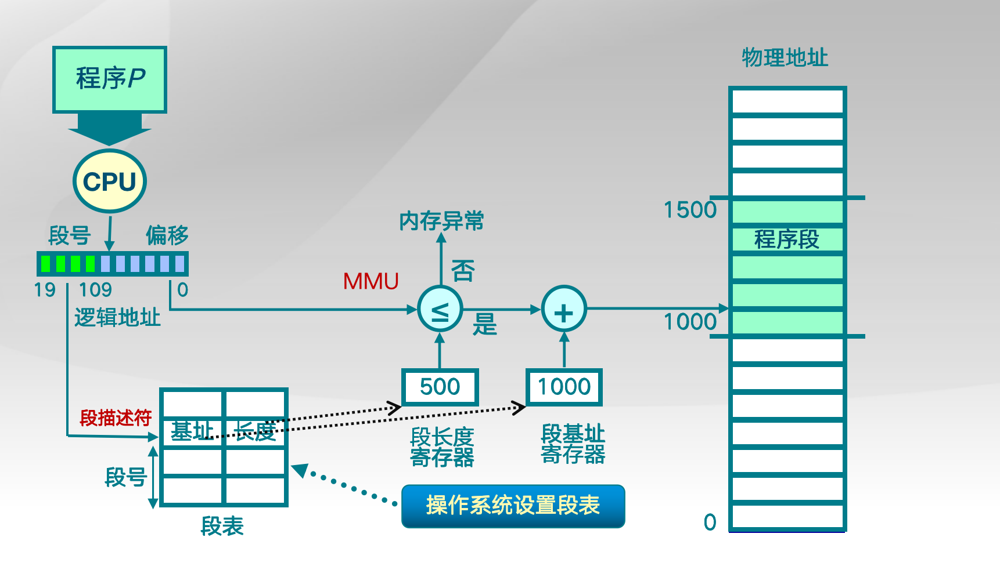
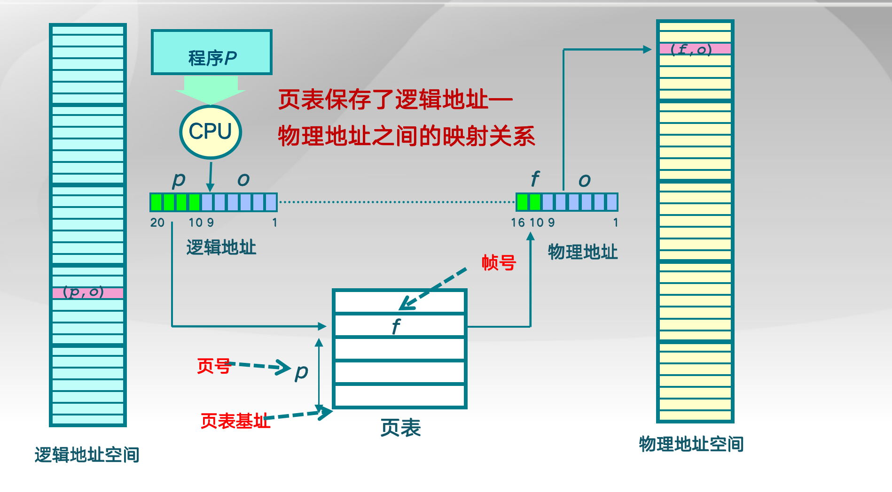
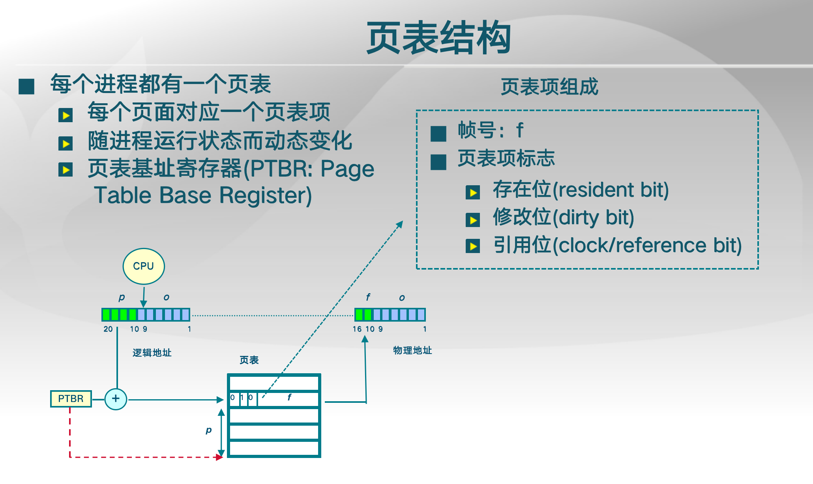
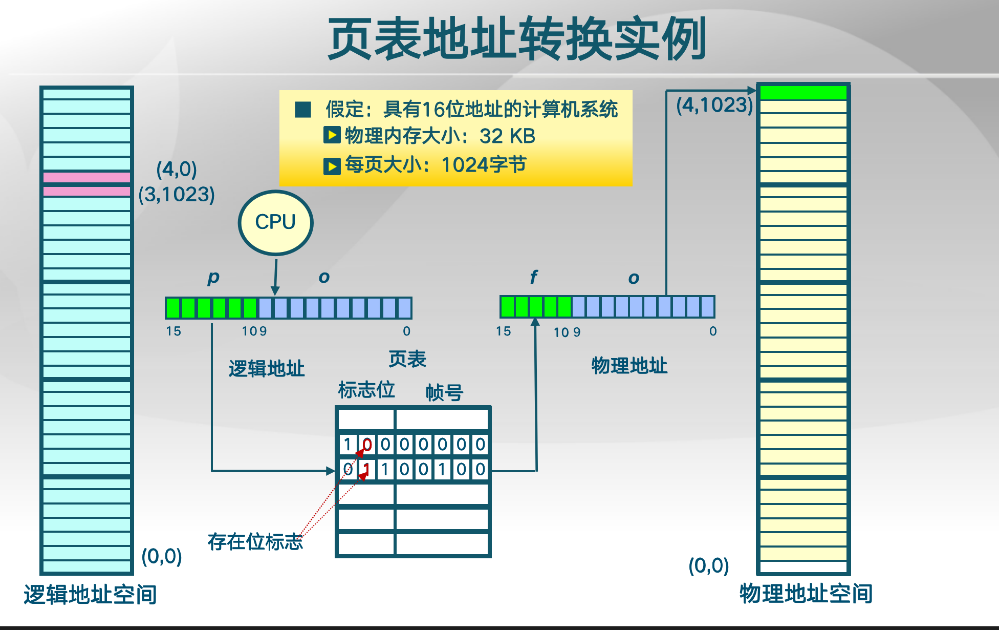
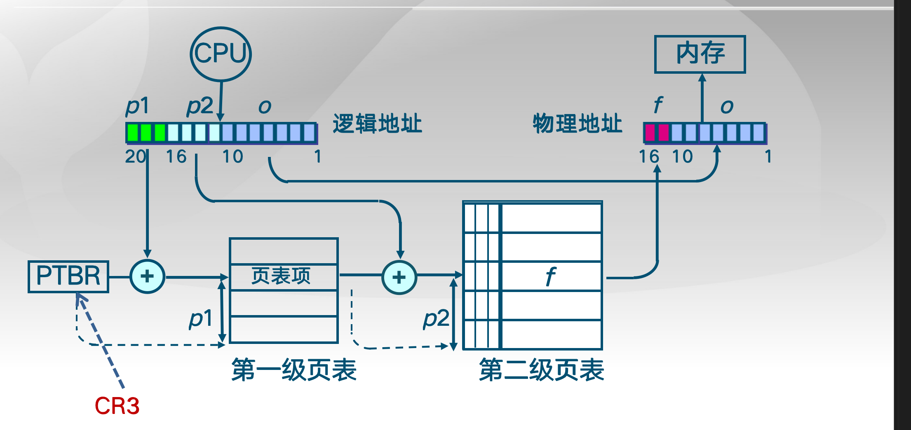
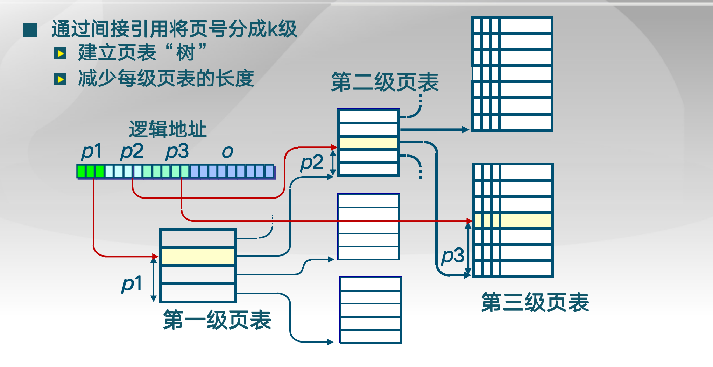
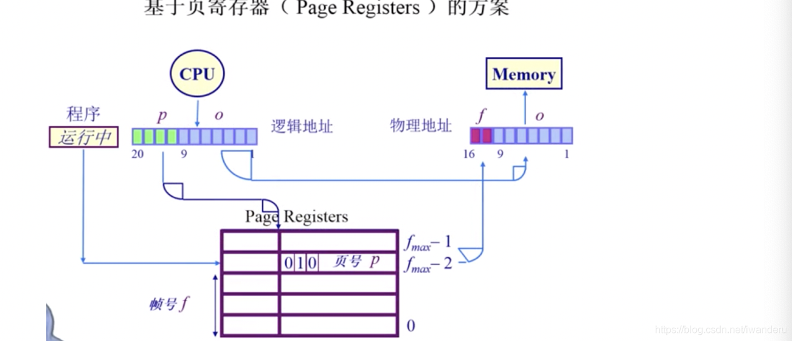

## 非连续内存分配

## 为什么需要非连续

因为连续分配的一些缺点

非连续又有什么优缺点？

软件实现和硬件实现的对比

## 分段

- 程序的分段地址空间
- 分段寻址方案

## 段地址空间

左边是连续的逻辑地址，右边是不连续的物理地址

软件映射开销大，我们需要利用硬件支持

一个段就是一个内存"块"

执行一段程序，cpu要去寻址

通过段号去找到物理内存中的起始地址

有一个硬件机制叫段表，存着逻辑地址和物理地址之间的对应关系

每个段的长度也不相同,这个信息也存在段表

## 分页

分段机制用的还比较少，主要是分页机制 ???

## 页帧和页

根据页号查询到帧号，帧号+offset

## 段式和页式的区别

段要考虑段大小不同，而页的大小是相同的

逻辑地址空间可能会大于物理地址空间 ： todo 为啥

## 页表

就是一个大数组，索引就是page number， 对应的是frame number

cpu会查到页表起始位置，通过page number算出index,然后通过页表项取出相应frame number

还有一些bit,标识位

我们这里16bits, 逻辑地址空间大小64KB，然而物理内存大小为32KB，可以看出逻辑地址大小和物理大小是不一样的

第4项标志位指向的为0，则不存在，若访问则产生内存访问异常

第三项标志位1，存在，对应的帧号是4，加上offset 1023及找到物理地址

## 分页机制的问题

空间和时间

64为机器，每页1024字节，一个页表大小是多少?

2^64 / 2^10 = 2^54 

逻辑地址空间很大导致我们的页表也很大，放不下，没法对应

多个进程，每个进程都有一个页表，占的空间n份很耗空间

访问效率问题: 组织结构不能放cpu里，放内存里，每次寻址，还是两次，开销很大

## 解决方案

一般解决这种问题两种方式 ： 1. 缓存 (到离CPU近的地方如cache) 2. 通过间接方式，用多级页表方式

## TLB

缓存解决时间开销

miss后将对应的表项从内存中存到CPU里

X86是靠CPU硬件来做

mips靠OS 软件来做

## 多级页表

优化页表的空间开销问题

虽然增加了内存访问次数和开销，但是节省了保存页表的空间(时间换空间，然后在通过TLB来减少时间消耗)。

先看简单点的二级页表

逻辑地址中，页号部分分成了2部分，p1和p2。

p1存放着二级页表的起始地址，p2的作用就是之前的p。

p1找二级页表，p2找frame，再加上offset。

这里体现了二级页表的另一个好处，就是p1对应的位置是flags，假如说resident bit是0，那么整个二级页表都不用在内存中保存，这个是一级页表无法实现的！

例如64位系统采用5级页表。占得空间也是挺大的

## 反向页表

页表来表示物理地址(页帧)号，而不是之前的逻辑地址(页号)，能够减少页表尺寸，但是给映射关系的建立带来点困难。

传统页表的缺点 ：

- 大地址空间问题 
- 逻辑地址空间增长速度快于物理地址空间，反向页表，也就是index是物理地址，value是逻辑地址，它的大小会小于传统页表。

## 反向页表的实现：基于页寄存器

frame number为索引，容量只与物理地址大小有关

如何建立通过page num找到frame num的机制?

## 反向页表的实现：基于关联内存associative memory

## 反向页表的实现：基于哈希查找hash的方案

hash会碰撞

