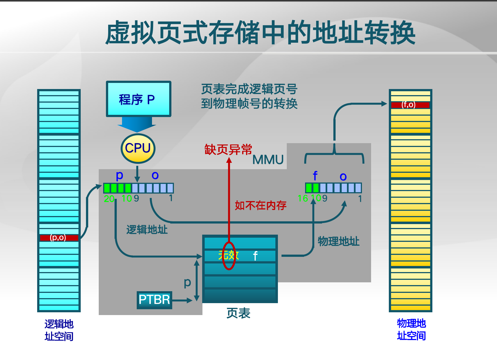

## 虚拟内存

## 虚拟内存的起因

## 覆盖技术

## 交换技术

粒度比较大，几十几百个页的粒度

硬盘要专门划出一片交换区，这个交换区要有多大

上次换出后，上次那个空间已被占用，再次换入可能位置不一样，寻址就有问题，就要用动态地址映射

## 覆盖和交换区别

覆盖增加程序员负担

交换增加处理器开销

## 虚拟存储技术

- 像覆盖技术一样，不是把程序的所有内容都放在内存中

- 能像交换技术那样，能够实现进程在内存和外存之间的交换。但对进程的部分内容在内存和外存之间进行交换。

## 局部性原理

## 虚存技术基本概念

缺页"异常"

## 基本特征

32位的虚拟地址理论上可以访问4GB，而可能计算机上仅有256M的物理内存，但硬盘容量大于4GB

## 具体实现

## 虚拟页式内存管理

页表项除了有页号对应的帧号，还有标志位bit，代表存在不存在，如果不存在那么就缺页异常，请求调页

## 页表项结构

