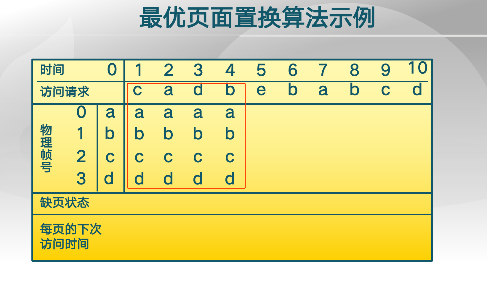

## 最优页面置换算法实例

先放入的是a,b,c,d

前四次访问无缺页

第五次缺页，需要置换一个出去，下一个最久的是d，所以置换d,e

## 先进先出

todo : belady现象

## LRU

根据过去，而不是根据未来

依据 ： 程序的局部性原理

## 时钟页面置换算法

依据是access bit(靠硬件支持)

## 改进

dirty bit 代表写操作

同时使用dirty bit 和 accessb bit 来指导

修改clock算法，使它允许脏页总是在一次时钟头扫描中保留下来

如果是一次写操作，dirty bit会设置为1.说明内存访问这部分数据时是有写入操作的，和硬盘上原数据不一样，所以要写入硬盘，如果是0，对这部分内存没有写操作，那么说明内存和硬盘上内容是一样的，直接释放掉即可。

目的就是减少对硬盘的写操作。

如果used和dirty bit都是0，那么替换掉；

如果其中一个是1，那么把这一位设置为0，指针往下走；

如果都是1，那先把used换为0，说明有2次机会。

写操作的页更多机会留在内存

只读更优先被换出去

## 工作集模型

